# AWS S3

Cloud object storage operations

> **11 tools** · API Photon · v1.0.0 · MIT


## ⚙️ Configuration


| Variable | Required | Type | Description |
|----------|----------|------|-------------|
| `AWS_S3_ACCESSKEYID` | Yes | string | AWS access key ID (required) |
| `AWS_S3_SECRETACCESSKEY` | Yes | string | AWS secret access key (required) |
| `AWS_S3_REGION` | No | string | AWS region (default: us-east-1) (default: `us-east-1`) |


### Setup Instructions

- accessKeyId: AWS access key ID (required)
- secretAccessKey: AWS secret access key (required)
- region: AWS region (default: us-east-1)


## 🔧 Tools


### `upload`

Upload object to bucket


| Parameter | Type | Required | Description |
|-----------|------|----------|-------------|
| `bucket` | string | Yes | Bucket name [min: 1, max: 63] (e.g. `my-app-bucket`) |
| `key` | string | Yes | Object key (file path) [min: 1, max: 1024] (e.g. `documents/report.pdf`) |
| `content` | string | Yes | Content to upload (string or base64) [min: 1] (e.g. `Hello World`) |
| `contentType` | string | No | MIME type [max: 100] (e.g. `text/plain`) |
| `encoding` | string | No | Content encoding [max: 20] (e.g. `base64`) |


---


### `download`

Download object from bucket


| Parameter | Type | Required | Description |
|-----------|------|----------|-------------|
| `bucket` | string | Yes | Bucket name [min: 1, max: 63] (e.g. `my-app-bucket`) |
| `key` | string | Yes | Object key (file path) [min: 1, max: 1024] (e.g. `documents/report.pdf`) |
| `encoding` | string | No | Return encoding (optional, "base64" for binary files) [max: 20] (e.g. `base64`) |


---


### `list`

List objects in bucket


| Parameter | Type | Required | Description |
|-----------|------|----------|-------------|
| `bucket` | string | Yes | Bucket name [min: 1, max: 63] (e.g. `my-app-bucket`) |
| `prefix` | string | No | Filter by key prefix [max: 1024] (e.g. `documents/`) |
| `maxKeys` | number | No | Maximum number of objects to return [min: 1, max: 1000] |


---


### `remove`

Delete object from bucket


| Parameter | Type | Required | Description |
|-----------|------|----------|-------------|
| `bucket` | string | Yes | Bucket name [min: 1, max: 63] (e.g. `my-app-bucket`) |
| `key` | string | Yes | Object key (file path) [min: 1, max: 1024] (e.g. `documents/old-report.pdf`) |


---


### `removeMany`

Delete multiple objects from bucket


| Parameter | Type | Required | Description |
|-----------|------|----------|-------------|
| `bucket` | string | Yes | Bucket name [min: 1, max: 63] (e.g. `my-app-bucket`) |
| `keys` | string[] | Yes | Array of object keys to delete [min: 1] (e.g. `["old/file1.txt","old/file2.txt"]`) |


---


### `metadata`

Get object metadata


| Parameter | Type | Required | Description |
|-----------|------|----------|-------------|
| `bucket` | string | Yes | Bucket name [min: 1, max: 63] (e.g. `my-app-bucket`) |
| `key` | string | Yes | Object key (file path) [min: 1, max: 1024] (e.g. `documents/report.pdf`) |


---


### `copy`

Copy object within S3


| Parameter | Type | Required | Description |
|-----------|------|----------|-------------|
| `sourceBucket` | string | Yes | Source bucket name [min: 1, max: 63] (e.g. `my-source-bucket`) |
| `sourceKey` | string | Yes | Source object key [min: 1, max: 1024] (e.g. `documents/original.pdf`) |
| `destinationBucket` | string | Yes | Destination bucket name [min: 1, max: 63] (e.g. `my-dest-bucket`) |
| `destinationKey` | string | Yes | Destination object key [min: 1, max: 1024] (e.g. `backups/copy.pdf`) |


---


### `presign`

Generate presigned URL for object access


| Parameter | Type | Required | Description |
|-----------|------|----------|-------------|
| `bucket` | string | Yes | Bucket name [min: 1, max: 63] (e.g. `my-app-bucket`) |
| `key` | string | Yes | Object key (file path) [min: 1, max: 1024] (e.g. `documents/report.pdf`) |
| `expiresIn` | number | No | Expiration time in seconds [min: 1, max: 604800] |
| `operation` | string | No | Operation type [max: 10] (e.g. `get`) |


---


### `buckets`

List all buckets


---


### `bucket`

Create a new bucket


| Parameter | Type | Required | Description |
|-----------|------|----------|-------------|
| `bucket` | string | Yes | Bucket name (must be globally unique) [min: 1, max: 63] (e.g. `my-new-app-bucket-2024`) |


---


### `removeBucket`

Delete a bucket (must be empty)


| Parameter | Type | Required | Description |
|-----------|------|----------|-------------|
| `bucket` | string | Yes | Bucket name [min: 1, max: 63] (e.g. `my-old-bucket`) |


---


## 🏗️ Architecture

```mermaid
flowchart LR
    subgraph aws_s3["📦 Aws S3"]
        direction TB
        PHOTON((🎯))
        T0[📤 upload]
        PHOTON --> T0
        T1[📥 download]
        PHOTON --> T1
        T2[📖 list]
        PHOTON --> T2
        T3[🗑️ remove]
        PHOTON --> T3
        T4[🗑️ removeMany]
        PHOTON --> T4
        T5[🔧 metadata]
        PHOTON --> T5
        T6[🔧 copy]
        PHOTON --> T6
        T7[🔧 presign]
        PHOTON --> T7
        T8[🔧 buckets]
        PHOTON --> T8
        T9[🔧 bucket]
        PHOTON --> T9
        T10[🗑️ removeBucket]
        PHOTON --> T10
    end
```




## 📥 Usage

```bash
# Install from marketplace
photon add aws-s3

# Get MCP config for your client
photon info aws-s3 --mcp
```

## 📦 Dependencies


```
@aws-sdk/client-s3@^3.511.0, @aws-sdk/s3-request-presigner@^3.511.0
```

---

MIT · v1.0.0 · Portel
