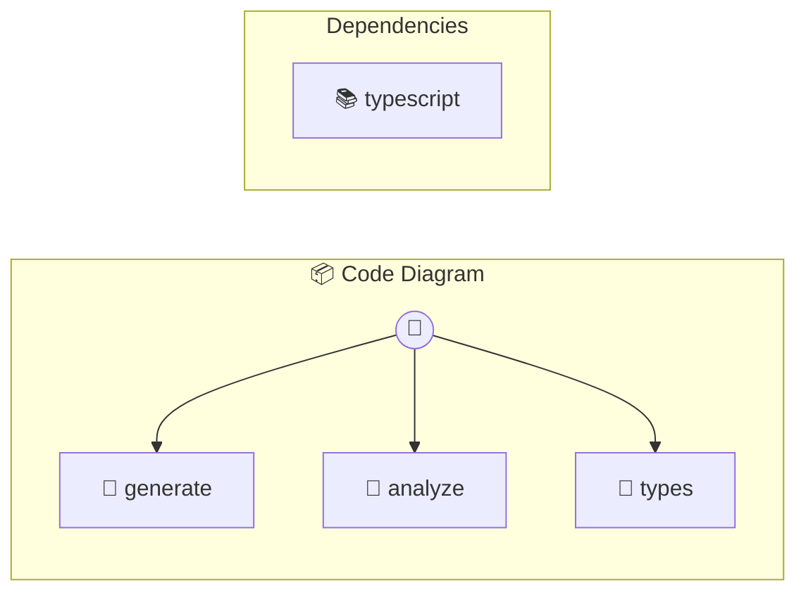

# Code Diagram

Mermaid visualization from source code

> **3 tools** · API Photon · v1.0.0 · MIT

**Platform Features:** `mcp-bridge` `photon-bridge`

## ⚙️ Configuration

No configuration required.


## 🔧 Tools


### `generate`

Generate diagram from code string


| Parameter | Type | Required | Description |
|-----------|------|----------|-------------|
| `code` | string | Yes | TypeScript/JavaScript source code |
| `type` | DiagramType | No | Diagram type {@default auto} [choice: auto,workflow,api,deps,calls] |
| `style` | DiagramStyle | No | Diagram style {@default linear} [choice: linear,branching,structure] |
| `name` | string | No | Diagram name {@default Code} |


---


### `analyze`

Generate diagram from file


| Parameter | Type | Required | Description |
|-----------|------|----------|-------------|
| `path` | string | Yes | File path (e.g. `/src/index.ts`) |
| `type` | DiagramType | No | Diagram type {@default auto} [choice: auto,workflow,api,deps,calls] |
| `style` | DiagramStyle | No | Diagram style {@default linear} [choice: linear,branching,structure] |


---


### `types`

List available diagram types and styles


---


## 🏗️ Architecture




## 📥 Usage

```bash
# Install from marketplace
photon add code-diagram

# Get MCP config for your client
photon info code-diagram --mcp
```

## 📦 Dependencies


```
typescript@^5.0.0
```

---

MIT · v1.0.0 · Portel
