# Code Diagram

Generate a Mermaid diagram from a file

> **3 tools** · API Photon · v1.0.0 · MIT

**Platform Features:** `mcp-bridge` `photon-bridge`

## ⚙️ Configuration

No configuration required.


## 🔧 Tools


### `generate`

Generate a Mermaid diagram from code string


| Parameter | Type | Required | Description |
|-----------|------|----------|-------------|
| `code` | any | Yes | The TypeScript/JavaScript code to analyze |
| `type` | any | Yes | Diagram type {@default auto} [choice: auto,workflow,api,deps,calls] |
| `style` | any | Yes | Diagram style {@default linear} [choice: linear,branching,structure] |
| `name` | any | Yes | Optional name for the diagram {@default Code} |


---


### `fromFile`

Generate a Mermaid diagram from a file


| Parameter | Type | Required | Description |
|-----------|------|----------|-------------|
| `path` | any | Yes | Path to the TypeScript/JavaScript file |
| `type` | any | Yes | Diagram type {@default auto} [choice: auto,workflow,api,deps,calls] |
| `style` | any | Yes | Diagram style {@default linear} [choice: linear,branching,structure] |


---


### `types`

List available diagram types and styles


---


## 🏗️ Architecture

```mermaid
flowchart LR
    subgraph code_diagram["📦 Code Diagram"]
        direction TB
        PHOTON((🎯))
        T0[🔧 generate]
        PHOTON --> T0
        T1[🔧 fromFile]
        PHOTON --> T1
        T2[🔧 types]
        PHOTON --> T2
    end

    subgraph deps["Dependencies"]
        direction TB
        NPM0[📚 typescript]
    end
```




## 📥 Usage

```bash
# Install from marketplace
photon add code-diagram

# Get MCP config for your client
photon get code-diagram --mcp
```

## 📦 Dependencies


```
typescript@^5.0.0
```

---

MIT · v1.0.0 · Portel
