# Connect Four

Play against AI with distributed locks Classic Connect Four game where you drop discs into columns trying to get four in a row. The AI opponent uses minimax with alpha-beta pruning to play strategically. Distributed locks ensure no two moves happen simultaneously - critical when multiple clients connect to the same game. ## Quick Reference - `start` - Start a new game - `drop` - Drop your disc into a column (1-7) - `board` - View current board state - `games` - List your games - `stats` - Win/loss statistics

> **8 tools** · API Photon · v1.0.0 · MIT

**Platform Features:** `custom-ui` `stateful` `channels`

## ⚙️ Configuration

No configuration required.


## 🔧 Tools


### `start`

Start a new Connect Four game  You play as 🔴 (Red), opponent plays as 🟡 (Yellow). Player always goes first.  In "builtin" mode, a minimax AI responds automatically after each move. In "mcp" mode, the MCP client (you, the AI assistant) plays as 🟡 by calling drop on your turn.


**Example:**

```typescript
start()
```


---


### `drop`

Drop a piece into a column  Uses a distributed lock to prevent simultaneous moves on the same game.  In builtin mode: places your piece, then the built-in AI auto-responds. In MCP mode: places the current player's piece (player or AI) and switches turns. The MCP client calls this on its turn to play as 🟡.


**Example:**

```typescript
drop({ column: 4 })
```


---


### `board`

View the current board


**Example:**

```typescript
board()
```


---


### `games`

List your games  Shows recent games with outcomes.


**Example:**

```typescript
games()
```


---


### `resign`

Resign the current game


---


### `stats`

Get your win/loss statistics


---


### `replay`

Replay a completed game move by move


---


### `scheduledCleanup`

Cleanup stale games  Removes active games with no moves for over 7 days and completed games older than 90 days.


---


## 🏗️ Architecture

```mermaid
flowchart LR
    subgraph connect_four["📦 Connect Four"]
        direction TB
        PHOTON((🎯))
        T0[▶️ start]
        PHOTON --> T0
        T1[🗑️ drop]
        PHOTON --> T1
        T2[🔧 board]
        PHOTON --> T2
        T3[🔧 games]
        PHOTON --> T3
        T4[🔧 resign]
        PHOTON --> T4
        T5[🔧 stats]
        PHOTON --> T5
        T6[🔧 replay]
        PHOTON --> T6
        T7[🔧 scheduledCleanup]
        PHOTON --> T7
    end
```




## 📥 Usage

```bash
# Install from marketplace
photon add connect-four

# Get MCP config for your client
photon info connect-four --mcp
```

## 📦 Dependencies

No external dependencies.

---

MIT · v1.0.0 · Portel
