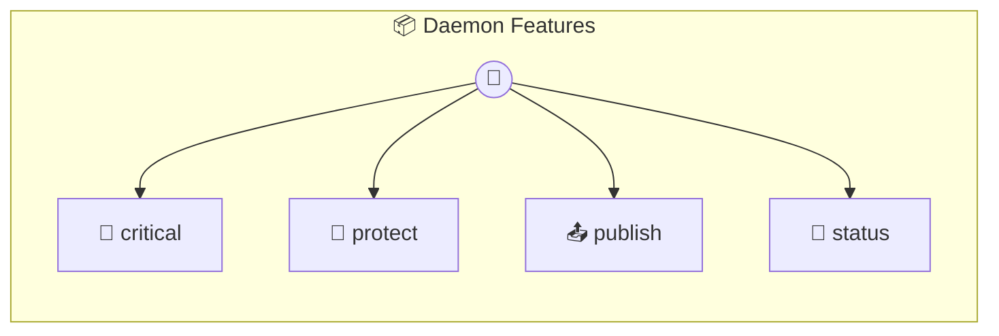

# Daemon Features

Scheduled Jobs, Webhooks, Locks, Pub/Sub

> **4 tools** · API Photon · v1.0.0 · MIT

**Platform Features:** `channels`

## ⚙️ Configuration

No configuration required.


## 🔧 Tools


### `critical`

Critical operation with distributed lock


---


### `protect`

Manual distributed locking with this.withLock()


---


### `publish`

Publish a message to a named channel


---


### `status`

Show daemon feature status


---


## 🏗️ Architecture




## 📥 Usage

```bash
# Install from marketplace
photon add daemon-features

# Get MCP config for your client
photon info daemon-features --mcp
```

## 📦 Dependencies

No external dependencies.

---

MIT · v1.0.0 · Portel
