# Daemon Features

Scheduled Jobs, Webhooks, Locks, Pub/Sub

> **6 tools** · API Photon · v1.0.0 · MIT

**Platform Features:** `webhooks` `channels`

## ⚙️ Configuration

No configuration required.


## 🔧 Tools


### `scheduledHeartbeat`

Heartbeat - writes timestamp to state file every minute  When the daemon runs this photon, the heartbeat proves scheduled execution works. Check with `status()` to see last run time.


---


### `handleWebhook`

Receive a webhook payload and echo it back with metadata  In daemon mode, this is exposed as a POST endpoint. The handler echoes the payload with added timestamp and processing info.


| Parameter | Type | Required | Description |
|-----------|------|----------|-------------|
| `payload` | Record<string | Yes | The webhook body (any JSON) |
| `source` | string | No | Optional source identifier |


---


### `critical`

A critical operation protected by a distributed lock  The @locked annotation ensures only one invocation runs at a time. Other callers wait until the lock is released.


| Parameter | Type | Required | Description |
|-----------|------|----------|-------------|
| `operation` | string | Yes | Name of the operation |


---


### `protect`

Demonstrates manual distributed locking with this.withLock()  Unlike @locked which auto-wraps the entire method, withLock() gives fine-grained control over which section is locked.


| Parameter | Type | Required | Description |
|-----------|------|----------|-------------|
| `resource` | string | Yes | Resource identifier to lock on |
| `value` | number | Yes | Value to process inside the lock |


---


### `publish`

Publish a message to a named channel  Other photons or clients subscribed to this channel will receive the event via the daemon's pub/sub system.


| Parameter | Type | Required | Description |
|-----------|------|----------|-------------|
| `channel` | string | Yes | Channel name to publish to |
| `message` | string | Yes | Message content |
| `priority` | 'low' | 'normal' | 'high' | No | Priority level |


---


### `status`

Show daemon feature status  Reads the heartbeat state file to show when the scheduled job last ran and how many times it has executed.


---


## 🏗️ Architecture

```mermaid
flowchart LR
    subgraph daemon_features["📦 Daemon Features"]
        direction TB
        PHOTON((🎯))
        T0[🔧 scheduledHeartbeat]
        PHOTON --> T0
        T1[🔧 handleWebhook]
        PHOTON --> T1
        T2[🔧 critical]
        PHOTON --> T2
        T3[🔧 protect]
        PHOTON --> T3
        T4[📤 publish]
        PHOTON --> T4
        T5[🔧 status]
        PHOTON --> T5
    end
```




## 📥 Usage

```bash
# Install from marketplace
photon add daemon-features

# Get MCP config for your client
photon info daemon-features --mcp
```

## 📦 Dependencies

No external dependencies.

---

MIT · v1.0.0 · Portel
