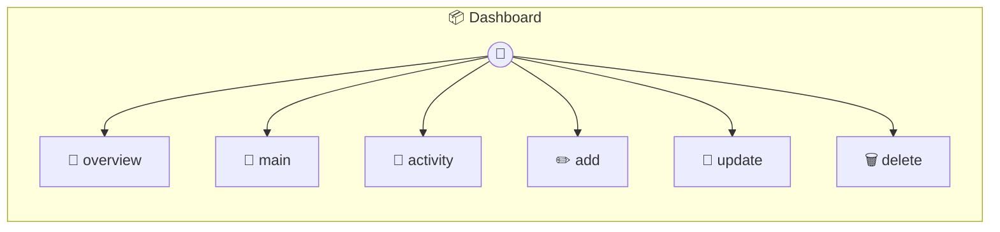

# Dashboard

Dashboard Photon A sleek dashboard demonstrating MCP Apps with UI templates. Each tool returns data that can be rendered in its linked UI. Data is persisted to ~/.photon/dashboard/data.json

> **6 tools** · API Photon · v1.0.0 · MIT

**Platform Features:** `custom-ui` `dashboard`

## ⚙️ Configuration

No configuration required.


## 📋 Quick Reference

| Method | Description |
|--------|-------------|
| `overview` | Dashboard overview with key metrics. |
| `main` | Dashboard main view - Task management |
| `activity` | Recent activity feed. |
| `add` | Add a new task |
| `update` | Update task status |
| `delete` | Delete a task |


## 🔧 Tools


### `overview`

Dashboard overview with key metrics. Returns metrics that can be displayed in a card grid UI.


---


### `main`

Dashboard main view - Task management


---


### `activity`

Recent activity feed. Returns activity stream for the timeline UI.


---


### `add`

Add a new task


| Parameter | Type | Required | Description |
|-----------|------|----------|-------------|
| `title` | string | Yes | Task title |
| `priority` | 'low' | 'medium' | 'high' | No | Task priority |


---


### `update`

Update task status


| Parameter | Type | Required | Description |
|-----------|------|----------|-------------|
| `id` | string | Yes | Task ID |
| `status` | 'pending' | 'in_progress' | 'completed' | Yes | New status |


---


### `delete`

Delete a task


| Parameter | Type | Required | Description |
|-----------|------|----------|-------------|
| `id` | string | Yes | Task ID to delete |


---


## 🏗️ Architecture




## 📥 Usage

```bash
# Install from marketplace
photon add dashboard

# Get MCP config for your client
photon info dashboard --mcp
```

## 📦 Dependencies

No external dependencies.

---

MIT · v1.0.0 · Portel
