# Dashboard

Dashboard Photon

> **6 tools** · API Photon · v1.0.0 · MIT

**Platform Features:** `custom-ui` `dashboard`

## ⚙️ Configuration

No configuration required.


## 🔧 Tools


### `overview`

Dashboard overview with key metrics  Returns metrics that can be displayed in a card grid UI.


---


### `main`

Dashboard main view - Task management


---


### `activity`

Recent activity feed  Returns activity stream for the timeline UI.


---


### `add`

Add a new task


| Parameter | Type | Required | Description |
|-----------|------|----------|-------------|
| `title` | string | Yes | Task title |
| `priority` | 'low' | 'medium' | 'high' | No | Task priority |


---


### `update`

Update task status


| Parameter | Type | Required | Description |
|-----------|------|----------|-------------|
| `id` | string | Yes | Task ID |
| `status` | 'pending' | 'in_progress' | 'completed' | Yes | New status |


---


### `delete`

Delete a task


| Parameter | Type | Required | Description |
|-----------|------|----------|-------------|
| `id` | string | Yes | Task ID to delete |


---


## 🏗️ Architecture

```mermaid
flowchart LR
    subgraph dashboard["📦 Dashboard"]
        direction TB
        PHOTON((🎯))
        T0[🔧 overview]
        PHOTON --> T0
        T1[🔧 main]
        PHOTON --> T1
        T2[🔧 activity]
        PHOTON --> T2
        T3[✏️ add]
        PHOTON --> T3
        T4[🔄 update]
        PHOTON --> T4
        T5[🗑️ delete]
        PHOTON --> T5
    end
```




## 📥 Usage

```bash
# Install from marketplace
photon add dashboard

# Get MCP config for your client
photon info dashboard --mcp
```

## 📦 Dependencies


```
@portel/photon-core@latest
```

---

MIT · v1.0.0 · Portel
