# Docker

Container management

> **10 tools** · API Photon · v1.0.0 · MIT


## ⚙️ Configuration


| Variable | Required | Type | Description |
|----------|----------|------|-------------|
| `DOCKER_M_C_P_SOCKETPATH` | No | string | No description available (default: `/var/run/docker.sock`) |


## 🔧 Tools


### `containers`

List containers


| Parameter | Type | Required | Description |
|-----------|------|----------|-------------|
| `all` | any | Yes | Show all containers {@default false, running only} |


---


### `start`

Start a container


| Parameter | Type | Required | Description |
|-----------|------|----------|-------------|
| `id` | string | Yes | Container ID or name (e.g. `my-container`) |


---


### `stop`

Stop a container


| Parameter | Type | Required | Description |
|-----------|------|----------|-------------|
| `id` | string | Yes | Container ID or name (e.g. `my-container`) |
| `timeout` | number | No | Seconds to wait before killing {@default 10} |


---


### `restart`

Restart a container


| Parameter | Type | Required | Description |
|-----------|------|----------|-------------|
| `id` | string | Yes | Container ID or name (e.g. `my-container`) |
| `timeout` | number | No | Seconds to wait before killing {@default 10} |


---


### `remove`

Remove a container


| Parameter | Type | Required | Description |
|-----------|------|----------|-------------|
| `id` | string | Yes | Container ID or name (e.g. `my-container`) |
| `force` | boolean | No | Force remove even if running {@default false} |


---


### `logs`

Get container logs


| Parameter | Type | Required | Description |
|-----------|------|----------|-------------|
| `id` | string | Yes | Container ID or name (e.g. `my-container`) |
| `tail` | number | No | Lines from end {@default 100} |
| `timestamps` | boolean | No | Show timestamps {@default true} |


---


### `stats`

Get container stats


| Parameter | Type | Required | Description |
|-----------|------|----------|-------------|
| `id` | string | Yes | Container ID or name (e.g. `my-container`) |


---


### `images`

List images


---


### `pull`

Pull an image


| Parameter | Type | Required | Description |
|-----------|------|----------|-------------|
| `name` | string | Yes | Image name (e.g. `nginx`) |
| `tag` | string | No | Image tag {@default latest} |


---


### `drop`

Remove an image


| Parameter | Type | Required | Description |
|-----------|------|----------|-------------|
| `id` | string | Yes | Image ID or name (e.g. `nginx:alpine`) |
| `force` | boolean | No | Force removal {@default false} |


---


## 🏗️ Architecture

```mermaid
flowchart LR
    subgraph docker["📦 Docker"]
        direction TB
        PHOTON((🎯))
        T0[🔧 containers]
        PHOTON --> T0
        T1[▶️ start]
        PHOTON --> T1
        T2[⏹️ stop]
        PHOTON --> T2
        T3[🔧 restart]
        PHOTON --> T3
        T4[🗑️ remove]
        PHOTON --> T4
        T5[🔧 logs]
        PHOTON --> T5
        T6[🔧 stats]
        PHOTON --> T6
        T7[🔧 images]
        PHOTON --> T7
        T8[🔧 pull]
        PHOTON --> T8
        T9[🗑️ drop]
        PHOTON --> T9
    end

    subgraph deps["Dependencies"]
        direction TB
        NPM0[📚 dockerode]
    end
```




## 📥 Usage

```bash
# Install from marketplace
photon add docker

# Get MCP config for your client
photon info docker --mcp
```

## 📦 Dependencies


```
dockerode@^4.0.0
```

---

MIT · v1.0.0 · Portel
