# Email

SMTP and IMAP email operations

> **8 tools** · API Photon · v1.1.0 · MIT


## ⚙️ Configuration


| Variable | Required | Type | Description |
|----------|----------|------|-------------|
| `EMAIL_PHOTON_SMTPHOST` | Yes | string | No description available |
| `EMAIL_PHOTON_SMTPPORT` | No | number | No description available (default: `587`) |
| `EMAIL_PHOTON_SMTPUSER` | Yes | string | No description available |
| `EMAIL_PHOTON_SMTPPASSWORD` | Yes | string | No description available |
| `EMAIL_PHOTON_SMTPSECURE` | No | boolean | No description available |
| `EMAIL_PHOTON_IMAPHOST` | No | string | No description available |
| `EMAIL_PHOTON_IMAPPORT` | No | number | No description available (default: `993`) |
| `EMAIL_PHOTON_IMAPUSER` | No | string | No description available |
| `EMAIL_PHOTON_IMAPPASSWORD` | No | string | No description available |


## 📋 Quick Reference

| Method | Description |
|--------|-------------|
| `send` | Send an email |
| `attach` | Send email with attachments |
| `inbox` | List emails from mailbox |
| `get` | Get email by UID |
| `search` | Search emails |
| `read` | Mark email as read |
| `remove` | Delete email |
| `move` | Move email to mailbox |


## 🔧 Tools


### `send`

Send an email


| Parameter | Type | Required | Description |
|-----------|------|----------|-------------|
| `to` | string | Yes | Recipient address [format: email] |
| `subject` | string | Yes | Subject line |
| `body` | string | Yes | Email body [field: textarea] |
| `html` | boolean | No | HTML content [choice: true,false] |
| `cc` | string | No | CC addresses [format: email] |
| `bcc` | string | No | BCC addresses [format: email] |


---


### `attach`

Send email with attachments


| Parameter | Type | Required | Description |
|-----------|------|----------|-------------|
| `to` | string | Yes | Recipient address [format: email] |
| `subject` | string | Yes | Subject line |
| `body` | string | Yes | Email body [field: textarea] |
| `attachments` | Array<{ filename: string | Yes | File attachments (JSON array) |
| `html` | any | No | HTML content [choice: true,false] |


---


### `inbox`

List emails from mailbox


| Parameter | Type | Required | Description |
|-----------|------|----------|-------------|
| `mailbox` | any | No | Mailbox name |
| `unread` | boolean | No | Unread only |
| `limit` | number } | No | Max results [min: 1, max: 100] |


---


### `get`

Get email by UID


| Parameter | Type | Required | Description |
|-----------|------|----------|-------------|
| `uid` | number | Yes | Email UID |
| `mailbox` | string | No | Mailbox name |


---


### `search`

Search emails


| Parameter | Type | Required | Description |
|-----------|------|----------|-------------|
| `query` | string | Yes | Search terms |
| `searchIn` | 'from' | 'subject' | 'body' | No | Search field {@default subject} [choice: from,subject,body] |
| `limit` | number | No | Max results [min: 1, max: 100] |
| `mailbox` | string | No | Mailbox name |


---


### `read`

Mark email as read


| Parameter | Type | Required | Description |
|-----------|------|----------|-------------|
| `uid` | number | Yes | Email UID |
| `mailbox` | string | No | Mailbox name |


---


### `remove`

Delete email


| Parameter | Type | Required | Description |
|-----------|------|----------|-------------|
| `uid` | number | Yes | Email UID |
| `mailbox` | string | No | Mailbox name |


---


### `move`

Move email to mailbox


| Parameter | Type | Required | Description |
|-----------|------|----------|-------------|
| `uid` | number | Yes | Email UID |
| `target` | string | Yes | Target mailbox name |
| `mailbox` | string | No | Source mailbox |


---


## 🏗️ Architecture

```mermaid
flowchart LR
    subgraph email["📦 Email"]
        direction TB
        PHOTON((🎯))
        T0[📤 send]
        PHOTON --> T0
        T1[🔧 attach]
        PHOTON --> T1
        T2[🔧 inbox]
        PHOTON --> T2
        T3[📖 get]
        PHOTON --> T3
        T4[📖 search]
        PHOTON --> T4
        T5[📖 read]
        PHOTON --> T5
        T6[🗑️ remove]
        PHOTON --> T6
        T7[🔧 move]
        PHOTON --> T7
    end

    subgraph deps["Dependencies"]
        direction TB
        NPM0[📚 nodemailer]
        NPM1[📚 imap]
        NPM2[📚 mailparser]
    end
```




## 📥 Usage

```bash
# Install from marketplace
photon add email

# Get MCP config for your client
photon info email --mcp
```

## 📦 Dependencies


```
nodemailer@^6.9.0, imap@^0.8.19, mailparser@^3.6.0
```

---

MIT · v1.1.0 · Portel
