# Email

Send and receive emails via SMTP and IMAP Provides email operations for sending, receiving, and managing emails. Supports SMTP for sending and IMAP for receiving/managing messages. Common use cases: - Send notifications: "Email me the daily report" - Check inbox: "Show me my unread emails" - Send with attachments: "Email this file to the team" - Search emails: "Find emails from john@example.com" Example: sendEmail({ to: "user@example.com", subject: "Report", body: "..." }) Configuration: - smtpHost: SMTP server hostname (e.g., smtp.gmail.com) - smtpPort: SMTP server port (default: 587 for TLS, 465 for SSL) - smtpUser: SMTP username/email - smtpPassword: SMTP password or app-specific password - smtpSecure: Use SSL (default: false, uses STARTTLS) - imapHost: IMAP server hostname (optional, for receiving) - imapPort: IMAP server port (optional, default: 993) - imapUser: IMAP username (optional, defaults to smtpUser) - imapPassword: IMAP password (optional, defaults to smtpPassword) Gmail Setup: 1. Enable 2FA in Google Account 2. Generate App Password: https://myaccount.google.com/apppasswords 3. Use: smtpHost=smtp.gmail.com, smtpUser=your@gmail.com, smtpPassword=app_password

> **8 tools** · API Photon · v1.1.0 · MIT


## ⚙️ Configuration


| Variable | Required | Type | Description |
|----------|----------|------|-------------|
| `EMAIL_SMTPHOST` | Yes | string | SMTP server hostname (e.g., smtp.gmail.com) |
| `EMAIL_SMTPPORT` | No | number | SMTP server port (default: 587 for TLS, 465 for SSL) (default: `587`) |
| `EMAIL_SMTPUSER` | Yes | string | SMTP username/email |
| `EMAIL_SMTPPASSWORD` | Yes | string | SMTP password or app-specific password |
| `EMAIL_SMTPSECURE` | No | boolean | Use SSL (default: false, uses STARTTLS) |
| `EMAIL_IMAPHOST` | No | string | IMAP server hostname (optional, for receiving) |
| `EMAIL_IMAPPORT` | No | number | IMAP server port (optional, default: 993) (default: `993`) |
| `EMAIL_IMAPUSER` | No | string | IMAP username (optional, defaults to smtpUser) |
| `EMAIL_IMAPPASSWORD` | No | string | IMAP password (optional, defaults to smtpPassword) |


### Setup Instructions

- smtpHost: SMTP server hostname (e.g., smtp.gmail.com)
- smtpPort: SMTP server port (default: 587 for TLS, 465 for SSL)
- smtpUser: SMTP username/email
- smtpPassword: SMTP password or app-specific password
- smtpSecure: Use SSL (default: false, uses STARTTLS)
- imapHost: IMAP server hostname (optional, for receiving)
- imapPort: IMAP server port (optional, default: 993)
- imapUser: IMAP username (optional, defaults to smtpUser)
- imapPassword: IMAP password (optional, defaults to smtpPassword)
Gmail Setup:
1. Enable 2FA in Google Account
2. Generate App Password: https://myaccount.google.com/apppasswords
3. Use: smtpHost=smtp.gmail.com, smtpUser=your@gmail.com, smtpPassword=app_password


## 🔧 Tools


### `send`

Send an email


| Parameter | Type | Required | Description |
|-----------|------|----------|-------------|
| `to` | string | Yes | Recipient email address or comma-separated addresses |
| `subject` | string | Yes | Email subject |
| `body` | string | Yes | Email body (plain text or HTML) |
| `html` | boolean | No | Set to true if body contains HTML |
| `cc` | string | No | CC recipients (optional, comma-separated) |
| `bcc` | string | No | BCC recipients (optional, comma-separated) |
| `from` | string | No | Sender email (optional, defaults to smtpUser) |


---


### `sendAttachment`

Send an email with attachments


| Parameter | Type | Required | Description |
|-----------|------|----------|-------------|
| `to` | string | Yes | Recipient email address |
| `subject` | string | Yes | Email subject |
| `body` | string | Yes | Email body |
| `attachments` | Array<{ filename: string | Yes | Array of attachments with filename and content |
| `html` | any | No | Set to true if body contains HTML |


---


### `inbox`

List emails from inbox


| Parameter | Type | Required | Description |
|-----------|------|----------|-------------|
| `limit` | any | No | Maximum number of emails to return |
| `unreadOnly` | boolean | No | Only return unread emails |
| `mailbox` | string } | No | Mailbox to check |


---


### `get`

Get a specific email by sequence number


| Parameter | Type | Required | Description |
|-----------|------|----------|-------------|
| `uid` | number | Yes | Email sequence number (from listInbox) |
| `mailbox` | string | No | Mailbox to check |


---


### `search`

Search emails by criteria


| Parameter | Type | Required | Description |
|-----------|------|----------|-------------|
| `query` | string | Yes | Search query (from, subject, or body text) |
| `searchIn` | 'from' | 'subject' | 'body' | No | Where to search: from, subject, or body |
| `limit` | number | No | Maximum results |
| `mailbox` | string | No | Mailbox to search |


---


### `markRead`

Mark an email as read


| Parameter | Type | Required | Description |
|-----------|------|----------|-------------|
| `uid` | number | Yes | Email sequence number |
| `mailbox` | string | No | Mailbox name |


---


### `remove`

Delete an email


| Parameter | Type | Required | Description |
|-----------|------|----------|-------------|
| `uid` | number | Yes | Email sequence number |
| `mailbox` | string | No | Mailbox name |


---


### `move`

Move email to another mailbox (archive)


| Parameter | Type | Required | Description |
|-----------|------|----------|-------------|
| `uid` | number | Yes | Email sequence number |
| `targetMailbox` | string | Yes | Target mailbox name (e.g., Archive, Trash) |
| `sourceMailbox` | string | No | Source mailbox |


---


## 🏗️ Architecture

```mermaid
flowchart LR
    subgraph email["📦 Email"]
        direction TB
        PHOTON((🎯))
        T0[📤 send]
        PHOTON --> T0
        T1[📤 sendAttachment]
        PHOTON --> T1
        T2[🔧 inbox]
        PHOTON --> T2
        T3[📖 get]
        PHOTON --> T3
        T4[📖 search]
        PHOTON --> T4
        T5[🔧 markRead]
        PHOTON --> T5
        T6[🗑️ remove]
        PHOTON --> T6
        T7[🔧 move]
        PHOTON --> T7
    end

    subgraph deps["Dependencies"]
        direction TB
        NPM0[📚 nodemailer]
        NPM1[📚 imap]
        NPM2[📚 mailparser]
    end
```




## 📥 Usage

```bash
# Install from marketplace
photon add email

# Get MCP config for your client
photon info email --mcp
```

## 📦 Dependencies


```
nodemailer@^6.9.0, imap@^0.8.19, mailparser@^3.6.0
```

---

MIT · v1.1.0 · Portel
