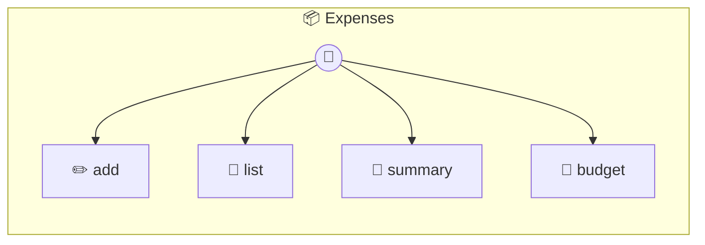

# Expenses

Track spending with budgets and summaries

> **4 tools** · API Photon · v1.0.0 · MIT

**Platform Features:** `stateful`

## ⚙️ Configuration

No configuration required.


## 🔧 Tools


### `add`

Add an expense


| Parameter | Type | Required | Description |
|-----------|------|----------|-------------|
| `amount` | number | Yes | Amount spent {@min 0.01} |
| `category` | string | Yes | Category [choice: food,transport,utilities,entertainment,other] |
| `description` | string | Yes | What the expense was for |
| `date` | string | No | Date of expense (YYYY-MM-DD) {@default today} |


---


### `list`

List all expenses


| Parameter | Type | Required | Description |
|-----------|------|----------|-------------|
| `category` | any | Yes | Filter by category [choice: food,transport,utilities,entertainment,other] |
| `month` | string } | No | Filter by month (YYYY-MM) |


---


### `summary`

Category spending summary


| Parameter | Type | Required | Description |
|-----------|------|----------|-------------|
| `month` | any | Yes | Filter by month (YYYY-MM) {@default current month} |


---


### `budget`

Set or check monthly budget


| Parameter | Type | Required | Description |
|-----------|------|----------|-------------|
| `limit` | any | Yes | Monthly spending limit in dollars (omit to check current) |


---


## 🏗️ Architecture


```mermaid
flowchart LR
    subgraph expenses["📦 Expenses"]
        direction TB
        PHOTON((🎯))
        T0[✏️ add]
        PHOTON --> T0
        T1[📖 list]
        PHOTON --> T1
        T2[🔧 summary]
        PHOTON --> T2
        T3[🔧 budget]
        PHOTON --> T3
    end
```


## 📥 Usage

```bash
# Install from marketplace
photon add expenses

# Get MCP config for your client
photon info expenses --mcp
```

## 📦 Dependencies

No external dependencies.

---

MIT · v1.0.0 · Portel
