# Expenses

Expense Tracker — Memory + Collection + Typed Fields Track personal expenses with category breakdowns and budget alerts. Uses `this.memory` for zero-boilerplate persistence, `Collection` for rich querying (groupBy, sum, where), and `Table` with typed fields for polished rendering (currency, badges, dates). Use named instances (`_use`) to keep personal vs work expenses separate.

> **4 tools** · API Photon · v1.8.4 · MIT


## ⚙️ Configuration

No configuration required.


## 🔧 Tools


### `add`

Add an expense


| Parameter | Type | Required | Description |
|-----------|------|----------|-------------|
| `amount` | number | Yes | Amount spent {@min 0.01} |
| `category` | string | Yes | Category (food, transport, utilities, entertainment, other) |
| `description` | string | Yes | What the expense was for |
| `date` | string | No | Date of expense (YYYY-MM-DD) {@default today} |


---


### `list`

List all expenses


| Parameter | Type | Required | Description |
|-----------|------|----------|-------------|
| `category` | any | Yes | Filter by category |
| `month` | string } | No | Filter by month (YYYY-MM) |


---


### `summary`

Category spending summary


| Parameter | Type | Required | Description |
|-----------|------|----------|-------------|
| `month` | any | Yes | Filter by month (YYYY-MM) {@default current month} |


---


### `budget`

Set or check monthly budget


| Parameter | Type | Required | Description |
|-----------|------|----------|-------------|
| `limit` | any | Yes | Monthly spending limit in dollars (omit to check current) |


---


## 🏗️ Architecture

```mermaid
flowchart LR
    subgraph expenses["📦 Expenses"]
        direction TB
        PHOTON((🎯))
        T0[✏️ add]
        PHOTON --> T0
        T1[📖 list]
        PHOTON --> T1
        T2[🔧 summary]
        PHOTON --> T2
        T3[🔧 budget]
        PHOTON --> T3
    end
```




## 📥 Usage

```bash
# Install from marketplace
photon add expenses

# Get MCP config for your client
photon info expenses --mcp
```

## 📦 Dependencies

No external dependencies.

---

MIT · v1.8.4
