# Filesystem

File and directory operations Provides safe, cross-platform file system operations using Node.js native APIs. All paths are validated and restricted to the working directory for security. Common use cases: - Reading files: "Read my project README.md" - Writing files: "Save this data to report.json" - Directory operations: "List all files in my Downloads folder" - File management: "Copy config.json to config.backup.json" Example: read({ path: "README.md" }) Configuration: - workdir: Working directory base path (default: ~/Documents) - maxFileSize: Maximum file size in bytes (default: 10MB) - allowHidden: Allow access to hidden files/directories (default: false)

> **13 tools** · API Photon · v1.1.0 · MIT


## ⚙️ Configuration


| Variable | Required | Type | Description |
|----------|----------|------|-------------|
| `FILESYSTEM_WORKDIR` | No | string | Working directory base path (default: ~/Documents) (default: `path.join(homedir(), '.photon')`) |
| `FILESYSTEM_MAXFILESIZE` | No | number | Maximum file size in bytes (default: 10MB) (default: `10485760`) |
| `FILESYSTEM_ALLOWHIDDEN` | No | boolean | Allow access to hidden files/directories (default: false) (default: `true`) |


### Setup Instructions

- workdir: Working directory base path (default: ~/Documents)
- maxFileSize: Maximum file size in bytes (default: 10MB)
- allowHidden: Allow access to hidden files/directories (default: false)


## 🔧 Tools


### `read`

Read file contents


| Parameter | Type | Required | Description |
|-----------|------|----------|-------------|
| `path` | string | Yes | File path (relative to workdir or absolute) |
| `encoding` | string | No | File encoding |


---


### `write`

Write content to file


| Parameter | Type | Required | Description |
|-----------|------|----------|-------------|
| `path` | string | Yes | File path (relative to workdir or absolute) |
| `content` | string | Yes | File content |
| `encoding` | string | No | File encoding |


---


### `append`

Append content to file


| Parameter | Type | Required | Description |
|-----------|------|----------|-------------|
| `path` | string | Yes | File path (relative to workdir or absolute) |
| `content` | string | Yes | Content to append |
| `encoding` | string | No | File encoding |


---


### `remove`

Remove a file


| Parameter | Type | Required | Description |
|-----------|------|----------|-------------|
| `path` | string | Yes | File path (relative to workdir or absolute) |


---


### `copy`

Copy a file


| Parameter | Type | Required | Description |
|-----------|------|----------|-------------|
| `source` | string | Yes | Source file path |
| `destination` | string | Yes | Destination file path |


---


### `move`

Move/rename a file


| Parameter | Type | Required | Description |
|-----------|------|----------|-------------|
| `source` | string | Yes | Source file path |
| `destination` | string | Yes | Destination file path |


---


### `list`

List files in a directory


| Parameter | Type | Required | Description |
|-----------|------|----------|-------------|
| `path` | any | Yes | Directory path (relative to workdir or absolute, default: current workdir) |
| `recursive` | boolean } | No | List files recursively |


---


### `mkdir`

Create a directory


| Parameter | Type | Required | Description |
|-----------|------|----------|-------------|
| `path` | string | Yes | Directory path (relative to workdir or absolute) |
| `recursive` | boolean | No | Create parent directories if needed |


---


### `rmdir`

Remove a directory


| Parameter | Type | Required | Description |
|-----------|------|----------|-------------|
| `path` | string | Yes | Directory path (relative to workdir or absolute) |
| `recursive` | boolean | No | Remove directory and all contents |


---


### `info`

Get file or directory information


| Parameter | Type | Required | Description |
|-----------|------|----------|-------------|
| `path` | string | Yes | File or directory path |


---


### `exists`

Check if file or directory exists


| Parameter | Type | Required | Description |
|-----------|------|----------|-------------|
| `path` | string | Yes | File or directory path |


---


### `search`

Search for files matching a pattern


| Parameter | Type | Required | Description |
|-----------|------|----------|-------------|
| `pattern` | string | Yes | File name pattern (glob-style: *.txt, **\/*.js) |
| `path` | string | No | Directory to search |


---


### `workdir`

Get current working directory


---


## 🏗️ Architecture

```mermaid
flowchart LR
    subgraph filesystem["📦 Filesystem"]
        direction TB
        PHOTON((🎯))
        T0[📖 read]
        PHOTON --> T0
        T1[✏️ write]
        PHOTON --> T1
        T2[🔧 append]
        PHOTON --> T2
        T3[🗑️ remove]
        PHOTON --> T3
        T4[🔧 copy]
        PHOTON --> T4
        T5[🔧 move]
        PHOTON --> T5
        T6[📖 list]
        PHOTON --> T6
        T7[🔧 mkdir]
        PHOTON --> T7
        T8[🔧 rmdir]
        PHOTON --> T8
        T9[🔧 info]
        PHOTON --> T9
        T10[🔧 exists]
        PHOTON --> T10
        T11[📖 search]
        PHOTON --> T11
        T12[🔧 workdir]
        PHOTON --> T12
    end
```




## 📥 Usage

```bash
# Install from marketplace
photon add filesystem

# Get MCP config for your client
photon info filesystem --mcp
```

## 📦 Dependencies

No external dependencies.

---

MIT · v1.1.0 · Portel
