# Filesystem

File and directory operations

> **12 tools** · API Photon · v1.1.0 · MIT


## ⚙️ Configuration


| Variable | Required | Type | Description |
|----------|----------|------|-------------|
| `FILESYSTEM_WORKDIR` | No | string | No description available (default: `path.join(homedir(), '.photon')`) |
| `FILESYSTEM_MAXFILESIZE` | No | number | No description available (default: `10485760`) |
| `FILESYSTEM_ALLOWHIDDEN` | No | boolean | No description available (default: `true`) |


## 📋 Quick Reference

| Method | Description |
|--------|-------------|
| `read` | Read file contents |
| `write` | Write content to file |
| `append` | Append content to file |
| `remove` | Delete a file |
| `copy` | Copy a file |
| `move` | Move/rename a file |
| `list` | List directory contents |
| `mkdir` | Create a directory |
| `rmdir` | Delete a directory |
| `info` | Get file info |
| `exists` | Check if path exists |
| `search` | Search for files matching pattern |


## 🔧 Tools


### `read`

Read file contents


| Parameter | Type | Required | Description |
|-----------|------|----------|-------------|
| `path` | string | Yes | File path (e.g. `README.md`) |
| `encoding` | string | No | File encoding {@default utf8} [choice: utf8,base64,hex] |


---


### `write`

Write content to file


| Parameter | Type | Required | Description |
|-----------|------|----------|-------------|
| `path` | string | Yes | File path (e.g. `README.md`) |
| `content` | string | Yes | File content [field: textarea] |
| `encoding` | string | No | File encoding {@default utf8} |


---


### `append`

Append content to file


| Parameter | Type | Required | Description |
|-----------|------|----------|-------------|
| `path` | string | Yes | File path |
| `content` | string | Yes | Content to append |
| `encoding` | string | No | File encoding {@default utf8} |


---


### `remove`

Delete a file


| Parameter | Type | Required | Description |
|-----------|------|----------|-------------|
| `path` | string | Yes | File path |


---


### `copy`

Copy a file


| Parameter | Type | Required | Description |
|-----------|------|----------|-------------|
| `source` | string | Yes | Source file path |
| `destination` | string | Yes | Destination file path |


---


### `move`

Move/rename a file


| Parameter | Type | Required | Description |
|-----------|------|----------|-------------|
| `source` | string | Yes | Source file path |
| `destination` | string | Yes | Destination file path |


---


### `list`

List directory contents


| Parameter | Type | Required | Description |
|-----------|------|----------|-------------|
| `path` | any | Yes | Directory path {@default .} |
| `recursive` | boolean } | No | List recursively {@default false} |


---


### `mkdir`

Create a directory


| Parameter | Type | Required | Description |
|-----------|------|----------|-------------|
| `path` | string | Yes | Directory path |
| `recursive` | boolean | No | Create parents {@default true} |


---


### `rmdir`

Delete a directory


| Parameter | Type | Required | Description |
|-----------|------|----------|-------------|
| `path` | string | Yes | Directory path |
| `recursive` | boolean | No | Delete with contents {@default false} |


---


### `info`

Get file info


| Parameter | Type | Required | Description |
|-----------|------|----------|-------------|
| `path` | string | Yes | File or directory path |


---


### `exists`

Check if path exists


| Parameter | Type | Required | Description |
|-----------|------|----------|-------------|
| `path` | string | Yes | File or directory path |


---


### `search`

Search for files matching pattern


| Parameter | Type | Required | Description |
|-----------|------|----------|-------------|
| `pattern` | string | Yes | File glob pattern (e.g. `*.txt`) |
| `path` | string | No | Directory to search {@default .} |


---


## 🏗️ Architecture

```mermaid
flowchart LR
    subgraph filesystem["📦 Filesystem"]
        direction TB
        PHOTON((🎯))
        T0[📖 read]
        PHOTON --> T0
        T1[✏️ write]
        PHOTON --> T1
        T2[🔧 append]
        PHOTON --> T2
        T3[🗑️ remove]
        PHOTON --> T3
        T4[🔧 copy]
        PHOTON --> T4
        T5[🔧 move]
        PHOTON --> T5
        T6[📖 list]
        PHOTON --> T6
        T7[🔧 mkdir]
        PHOTON --> T7
        T8[🔧 rmdir]
        PHOTON --> T8
        T9[🔧 info]
        PHOTON --> T9
        T10[🔧 exists]
        PHOTON --> T10
        T11[📖 search]
        PHOTON --> T11
    end
```




## 📥 Usage

```bash
# Install from marketplace
photon add filesystem

# Get MCP config for your client
photon info filesystem --mcp
```

## 📦 Dependencies

No external dependencies.

---

MIT · v1.1.0 · Portel
