# Form Inbox

Webhook-powered form submission collector Create forms, receive submissions via webhooks, and manage responses. Perfect for contact forms, feedback collection, surveys, and event RSVPs. ## Webhook URLs POST /webhook/form-inbox/handleSubmission?form=<formId> POST /webhook/form-inbox/handleBulkImport?form=<formId> ## Quick Reference - `forms` — List all forms - `formCreate` — Create a new form with fields - `submissions` — View submissions for a form - `export` — Export submissions as CSV/JSON

> **12 tools** · API Photon · v1.0.0 · MIT

**Platform Features:** `stateful` `channels`

## ⚙️ Configuration

No configuration required.


## 🔧 Tools


### `forms`

List all forms with submission counts


---


### `formCreate`

Create a new form with field definitions


**Example:**

```typescript
formCreate({ name: "Contact Form", fields: [{ name: "email", type: "email", required: true }, { name: "message", type: "textarea", required: true }] })
```


---


### `formDelete`

Delete a form and all its submissions


---


### `submissions`

List submissions for a form with pagination


**Example:**

```typescript
submissions({ formId: "abc123" })
```


---


### `submission`

Get a single submission detail


---


### `submissionDelete`

Delete a submission


---


### `export`

Export submissions as JSON or CSV


**Example:**

```typescript
export({ formId: "abc123", format: "csv" })
```


---


### `stats`

Submission statistics across all forms  Shows total submissions, per-form counts, and submissions per day for the last 7 days.


---


### `handleSubmission`

Receive form submission via webhook  POST /webhook/form-inbox/handleSubmission?form=<formId> Body: JSON matching form field names


---


### `handleBulkImport`

Receive bulk CSV import via webhook  POST /webhook/form-inbox/handleBulkImport?form=<formId> Body: { csv: "header1,header2\nval1,val2\n..." }


---


### `scheduledDigest`

Daily submission digest  Sends summary of yesterday's submissions across all forms.


---


### `scheduledCleanup`

Cleanup old submissions  Removes submissions older than 90 days to keep data manageable.


---


## 🏗️ Architecture

```mermaid
flowchart LR
    subgraph form_inbox["📦 Form Inbox"]
        direction TB
        PHOTON((🎯))
        T0[🔧 forms]
        PHOTON --> T0
        T1[🔧 formCreate]
        PHOTON --> T1
        T2[🔧 formDelete]
        PHOTON --> T2
        T3[🔧 submissions]
        PHOTON --> T3
        T4[🔧 submission]
        PHOTON --> T4
        T5[🔧 submissionDelete]
        PHOTON --> T5
        T6[📥 export]
        PHOTON --> T6
        T7[🔧 stats]
        PHOTON --> T7
        T8[🔧 handleSubmission]
        PHOTON --> T8
        T9[🔧 handleBulkImport]
        PHOTON --> T9
        T10[🔧 scheduledDigest]
        PHOTON --> T10
        T11[🔧 scheduledCleanup]
        PHOTON --> T11
    end
```




## 📥 Usage

```bash
# Install from marketplace
photon add form-inbox

# Get MCP config for your client
photon info form-inbox --mcp
```

## 📦 Dependencies

No external dependencies.

---

MIT · v1.0.0 · Portel
