# Form Inbox

Webhook-powered form submission collector

> **12 tools** · API Photon · v1.0.0 · MIT

**Platform Features:** `stateful` `channels`

## ⚙️ Configuration

No configuration required.


## 🔧 Tools


### `forms`

List all forms with submission counts


---


### `create`

Create a new form with field definitions


---


### `delete`

Delete a form and all its submissions


---


### `submissions`

List submissions for a form with pagination


---


### `submission`

Get a single submission detail


---


### `remove`

Delete a submission


---


### `export`

Export submissions as JSON or CSV


---


### `stats`

Submission statistics across all forms


---


### `handleSubmission`

Receive form submission via webhook


---


### `handleBulkImport`

Receive bulk CSV import via webhook


---


### `scheduledDigest`

Daily submission digest


---


### `scheduledCleanup`

Cleanup old submissions (90+ days)


---


## 🏗️ Architecture

```mermaid
flowchart LR
    subgraph form_inbox["📦 Form Inbox"]
        direction TB
        PHOTON((🎯))
        T0[🔧 forms]
        PHOTON --> T0
        T1[✏️ create]
        PHOTON --> T1
        T2[🗑️ delete]
        PHOTON --> T2
        T3[🔧 submissions]
        PHOTON --> T3
        T4[🔧 submission]
        PHOTON --> T4
        T5[🗑️ remove]
        PHOTON --> T5
        T6[📥 export]
        PHOTON --> T6
        T7[🔧 stats]
        PHOTON --> T7
        T8[🔧 handleSubmission]
        PHOTON --> T8
        T9[🔧 handleBulkImport]
        PHOTON --> T9
        T10[🔧 scheduledDigest]
        PHOTON --> T10
        T11[🔧 scheduledCleanup]
        PHOTON --> T11
    end
```




## 📥 Usage

```bash
# Install from marketplace
photon add form-inbox

# Get MCP config for your client
photon info form-inbox --mcp
```

## 📦 Dependencies

No external dependencies.

---

MIT · v1.0.0 · Portel
