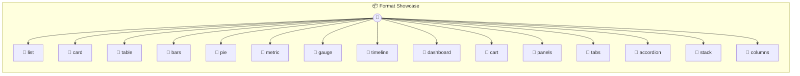

# month, @value revenue}

Auto-UI Format Demos

> **15 tools** · API Photon · v1.0.0 · MIT


## ⚙️ Configuration

No configuration required.


## 🔧 Tools


### `list`

iOS-style list with title, subtitle, and badge


---


### `card`

Single object displayed as a card


---


### `table`

Array of objects displayed as a sortable table


---


### `bars`

Bar chart showing monthly revenue


---


### `pie`

Pie chart showing budget breakdown


---


### `metric`

Single KPI metric with delta


---


### `gauge`

Circular gauge showing CPU usage


---


### `timeline`

Vertical timeline of project milestones


---


### `dashboard`

Composite dashboard with mixed data types


---


### `cart`

Shopping cart with items and totals


---


### `panels`

CSS grid of titled panels rendering inner content as cards


---


### `tabs`

Tab bar switching between categorized lists


---


### `accordion`

Collapsible FAQ sections


---


### `stack`

Vertical stack of KPI metrics


---


### `columns`

Side-by-side pie charts comparing plans


---


## 🏗️ Architecture




## 📥 Usage

```bash
# Install from marketplace
photon add format-showcase

# Get MCP config for your client
photon info format-showcase --mcp
```

## 📦 Dependencies

No external dependencies.

---

MIT · v1.0.0 · Portel
