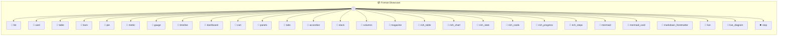

# month, @value revenue}

Auto-UI Format Demos Demonstrates every auto-UI format type with sample data so developers can see how each visualization looks and choose appropriately. Run any method in Beam to see the visual output.

> **28 tools** · API Photon · v1.0.0 · MIT

**Platform Features:** `channels`

## ⚙️ Configuration

No configuration required.


## 📋 Quick Reference

| Method | Description |
|--------|-------------|
| `list` | Uses **` |
| `card` | Uses **` |
| `table` | Uses **` |
| `bars` | Uses **` |
| `pie` | Uses **` |
| `metric` | Uses **` |
| `gauge` | Uses **` |
| `timeline` | Uses **` |
| `dashboard` | Uses **` |
| `cart` | Uses **` |
| `panels` | Uses **` |
| `tabs` | Uses **` |
| `accordion` | Uses **` |
| `stack` | Uses **` |
| `columns` | Uses **` |
| `magazine` | Uses **` |
| `rich_table` | Uses the **`Table`** class — the programmatic approach. |
| `rich_chart` | Uses the **`Chart`** class — the programmatic approach. |
| `rich_stats` | Uses the **`Stats`** class — the programmatic approach. |
| `rich_cards` | Uses the **`Cards`** class — the programmatic approach. |
| `rich_progress` | Uses the **`Progress`** class — multi-bar progress display. |
| `rich_steps` | Uses the **`Progress`** class in `steps` mode — a step indicator. |
| `mermaid` | Returns a **mermaid flowchart** as a plain string. |
| `mermaid_card` | Returns an object with a **mermaid diagram embedded** in a field. |
| `markdown_frontmatter` | Returns **markdown with YAML frontmatter** — the metadata block between `---` fences is extracted and rendered as a table above the body. |
| `live` | *Live streaming** — gauge updates every second via `this.emit()`. |
| `live_diagram` | *Animated diagram** — a flowchart that builds itself step by step. |
| `stop` | Stops the live gauge stream started by `live()` or the diagram animation started by `live_diagram()`. |


## 🔧 Tools


### `list`

Uses **`


---


### `card`

Uses **`


---


### `table`

Uses **`


---


### `bars`

Uses **`


---


### `pie`

Uses **`


---


### `metric`

Uses **`


---


### `gauge`

Uses **`


---


### `timeline`

Uses **`


---


### `dashboard`

Uses **`


---


### `cart`

Uses **`


---


### `panels`

Uses **`


---


### `tabs`

Uses **`


---


### `accordion`

Uses **`


---


### `stack`

Uses **`


---


### `columns`

Uses **`


---


### `magazine`

Uses **`


---


### `rich_table`

Uses the **`Table`** class — the programmatic approach. Explicit column types (`number`, `badge`, `currency`), custom headers, and a title. Note the `currency` column on budget — something `


---


### `rich_chart`

Uses the **`Chart`** class — the programmatic approach. Supports **multiple series** (revenue vs cost), axis labels, and titles. The `


---


### `rich_stats`

Uses the **`Stats`** class — the programmatic approach. Typed formatters: `.currency()`, `.count()`, `.percent()` auto-format values. Each stat gets trend indicators and labels — no manual formatting needed. Compare with `metric()` for the declarative single-KPI `


---


### `rich_cards`

Uses the **`Cards`** class — the programmatic approach. Explicit field roles: `.heading()`, `.subtitle()`, `.badge()`, `.image()`. Gives you control over which fields render and how — without annotations. Compare with `list()` for the declarative `


---


### `rich_progress`

Uses the **`Progress`** class — multi-bar progress display. Each `.bar()` gets a label, percentage, and color. Use for project phases, skill levels, or any multi-track progress.


---


### `rich_steps`

Uses the **`Progress`** class in `steps` mode — a step indicator. Each `.step()` has a status: `completed`, `current`, or `pending`. Perfect for checkout flows, onboarding wizards, or multi-stage processes.


---


### `mermaid`

Returns a **mermaid flowchart** as a plain string. The auto-UI detects mermaid syntax and renders the diagram visually. No `


---


### `mermaid_card`

Returns an object with a **mermaid diagram embedded** in a field. When the auto-UI renders this as a card, the `diagram` field is detected as mermaid and rendered visually — other fields render normally.


---


### `markdown_frontmatter`

Returns **markdown with YAML frontmatter** — the metadata block between `---` fences is extracted and rendered as a table above the body. This mirrors how static-site generators (Jekyll, Hugo) handle frontmatter. The auto-UI detects the `---` opener and converts key-value pairs to a table.


---


### `live`

*Live streaming** — gauge updates every second via `this.emit()`. Combines `


---


### `live_diagram`

*Animated diagram** — a flowchart that builds itself step by step. Emits progressively larger mermaid strings via `this.emit()`. Each update adds a new node or connection, so you see the diagram grow in real time. Demonstrates streaming mermaid rendering with smooth SVG transitions.


---


### `stop`

Stops the live gauge stream started by `live()` or the diagram animation started by `live_diagram()`.


---


## 🏗️ Architecture


```mermaid
flowchart LR
    subgraph format_showcase["📦 Format Showcase"]
        direction TB
        PHOTON((🎯))
        T0[📖 list]
        PHOTON --> T0
        T1[🔧 card]
        PHOTON --> T1
        T2[🔧 table]
        PHOTON --> T2
        T3[🔧 bars]
        PHOTON --> T3
        T4[🔧 pie]
        PHOTON --> T4
        T5[🔧 metric]
        PHOTON --> T5
        T6[🔧 gauge]
        PHOTON --> T6
        T7[🔧 timeline]
        PHOTON --> T7
        T8[🔧 dashboard]
        PHOTON --> T8
        T9[🔧 cart]
        PHOTON --> T9
        T10[🔧 panels]
        PHOTON --> T10
        T11[🔧 tabs]
        PHOTON --> T11
        T12[🔧 accordion]
        PHOTON --> T12
        T13[🔧 stack]
        PHOTON --> T13
        T14[🔧 columns]
        PHOTON --> T14
        T15[🔧 magazine]
        PHOTON --> T15
        T16[🔧 rich_table]
        PHOTON --> T16
        T17[🔧 rich_chart]
        PHOTON --> T17
        T18[🔧 rich_stats]
        PHOTON --> T18
        T19[🔧 rich_cards]
        PHOTON --> T19
        T20[🔧 rich_progress]
        PHOTON --> T20
        T21[🔧 rich_steps]
        PHOTON --> T21
        T22[🔧 mermaid]
        PHOTON --> T22
        T23[🔧 mermaid_card]
        PHOTON --> T23
        T24[🔧 markdown_frontmatter]
        PHOTON --> T24
        T25[🔧 live]
        PHOTON --> T25
        T26[🔧 live_diagram]
        PHOTON --> T26
        T27[⏹️ stop]
        PHOTON --> T27
    end
```


## 📥 Usage

```bash
# Install from marketplace
photon add format-showcase

# Get MCP config for your client
photon info format-showcase --mcp
```

## 📦 Dependencies

No external dependencies.

---

MIT · v1.0.0 · Portel
