# month, @value revenue}

Auto-UI Format Demos

> **27 tools** · API Photon · v1.0.0 · MIT

**Platform Features:** `channels`

## ⚙️ Configuration

No configuration required.


## 🔧 Tools


### `list`

Uses **`@format list`** — the declarative approach. Maps fields to roles via `@title`, `@subtitle`, `@icon`, `@badge`. The auto-UI renders an iOS-style list with no code overhead. Compare with `rich_cards()` for the programmatic approach.


---


### `card`

Uses **`@format card`** — renders a single object as a detail card. Each key becomes a labeled field. No column definitions needed. Best for profile pages, detail views, or single-record displays.


---


### `table`

Uses **`@format table`** — the declarative approach. Returns raw data; auto-UI infers column types from the data shape. Best when your data is simple and needs zero code overhead. Compare with `rich_table()` for the programmatic approach with typed columns.


---


### `bars`

Uses **`@format chart:bar`** — the declarative approach. Maps `@label` and `@value` to axis roles. Single-series only. Best for quick visualizations of simple label→value data. Compare with `rich_chart()` for multi-series and axis control.


---


### `pie`

Uses **`@format chart:pie`** — declarative pie chart. Maps `@label` and `@value` for slice names and sizes. Great for proportional breakdowns with minimal code.


---


### `metric`

Uses **`@format metric`** — a single KPI with trend indicator. Returns `label`, `value`, `unit`, and `delta` fields. The auto-UI renders a prominent number with up/down trend arrow.


---


### `gauge`

Uses **`@format gauge`** — a circular gauge with min/max bounds. Renders a radial progress indicator. Use `@min` and `@max` to set the range. Best for single values within a known range (CPU, battery, score).


---


### `timeline`

Uses **`@format timeline`** — a vertical event sequence. Maps `@date`, `@title`, and `@description` to timeline nodes. Ideal for project milestones, changelogs, or activity feeds.


---


### `dashboard`

Uses **`@format dashboard`** — a composite layout for mixed data. Returns an object with metrics, gauges, tables, and charts as fields. The auto-UI detects each sub-shape and renders the appropriate widget. One annotation, multiple visualizations.


---


### `cart`

Uses **`@format cart`** — a shopping cart with line items and totals. Expects `items[]` with `name`, `price`, `quantity`, and optional `image`. Auto-renders item list, subtotal, tax, and total with formatting.


---


### `panels`

Uses **`@format panels`** — a CSS grid of titled panels. Each top-level key becomes a panel title; the value renders via `@inner`. Here `@inner card` renders each department as a detail card. Use `@columns` to control the grid.


---


### `tabs`

Uses **`@format tabs`** — a tab bar switching between groups. Each top-level key becomes a tab; `@inner list` renders the tab content. Great for categorized data where each category has similar structure.


---


### `accordion`

Uses **`@format accordion`** — collapsible sections. Each top-level key becomes a section header; `@inner kv` renders key-value pairs inside. Perfect for FAQs, settings groups, or categorized reference data.


---


### `stack`

Uses **`@format stack`** — vertical stack of metrics. Each key becomes a stacked widget rendered via `@inner metric`. Use for KPI dashboards where metrics should read top-to-bottom.


---


### `columns`

Uses **`@format columns`** — side-by-side layout. Each key becomes a column; `@inner chart:pie` renders pie charts. Use `@columns` to control how many fit per row.


---


### `rich_table`

Uses the **`Table`** class — the programmatic approach. Explicit column types (`number`, `badge`, `currency`), custom headers, and a title. Note the `currency` column on budget — something `@format table` can't express. Compare with `table()` for the declarative `@format` approach.


---


### `rich_chart`

Uses the **`Chart`** class — the programmatic approach. Supports **multiple series** (revenue vs cost), axis labels, and titles. The `@format chart:bar` annotation is single-series only. Compare with `bars()` for the declarative `@format` approach.


---


### `rich_stats`

Uses the **`Stats`** class — the programmatic approach. Typed formatters: `.currency()`, `.count()`, `.percent()` auto-format values. Each stat gets trend indicators and labels — no manual formatting needed. Compare with `metric()` for the declarative single-KPI `@format` approach.


---


### `rich_cards`

Uses the **`Cards`** class — the programmatic approach. Explicit field roles: `.heading()`, `.subtitle()`, `.badge()`, `.image()`. Gives you control over which fields render and how — without annotations. Compare with `list()` for the declarative `@format list` approach.


---


### `rich_progress`

Uses the **`Progress`** class — multi-bar progress display. Each `.bar()` gets a label, percentage, and color. Use for project phases, skill levels, or any multi-track progress.


---


### `rich_steps`

Uses the **`Progress`** class in `steps` mode — a step indicator. Each `.step()` has a status: `completed`, `current`, or `pending`. Perfect for checkout flows, onboarding wizards, or multi-stage processes.


---


### `mermaid`

Returns a **mermaid flowchart** as a plain string. The auto-UI detects mermaid syntax and renders the diagram visually. No `@format` needed — detection is automatic from the string content.


---


### `mermaid_card`

Returns an object with a **mermaid diagram embedded** in a field. When the auto-UI renders this as a card, the `diagram` field is detected as mermaid and rendered visually — other fields render normally.


---


### `markdown_frontmatter`

Returns **markdown with YAML frontmatter** — the metadata block between `---` fences is extracted and rendered as a table above the body. This mirrors how static-site generators (Jekyll, Hugo) handle frontmatter. The auto-UI detects the `---` opener and converts key-value pairs to a table.


---


### `live`

*Live streaming** — gauge updates every second via `this.emit()`. Combines `@format gauge` with real-time channel events. The initial return renders immediately; subsequent `emit()` calls update the value.


---


### `live_diagram`

*Animated diagram** — a flowchart that builds itself step by step. Emits progressively larger mermaid strings via `this.emit()`. Each update adds a new node or connection, so you see the diagram grow in real time. Demonstrates streaming mermaid rendering with smooth SVG transitions.


---


### `stop`

Stops the live gauge stream started by `live()` or the diagram animation started by `live_diagram()`.


---


## 🏗️ Architecture

```mermaid
flowchart LR
    subgraph format_showcase["📦 Format Showcase"]
        direction TB
        PHOTON((🎯))
        T0[📖 list]
        PHOTON --> T0
        T1[🔧 card]
        PHOTON --> T1
        T2[🔧 table]
        PHOTON --> T2
        T3[🔧 bars]
        PHOTON --> T3
        T4[🔧 pie]
        PHOTON --> T4
        T5[🔧 metric]
        PHOTON --> T5
        T6[🔧 gauge]
        PHOTON --> T6
        T7[🔧 timeline]
        PHOTON --> T7
        T8[🔧 dashboard]
        PHOTON --> T8
        T9[🔧 cart]
        PHOTON --> T9
        T10[🔧 panels]
        PHOTON --> T10
        T11[🔧 tabs]
        PHOTON --> T11
        T12[🔧 accordion]
        PHOTON --> T12
        T13[🔧 stack]
        PHOTON --> T13
        T14[🔧 columns]
        PHOTON --> T14
        T15[🔧 rich_table]
        PHOTON --> T15
        T16[🔧 rich_chart]
        PHOTON --> T16
        T17[🔧 rich_stats]
        PHOTON --> T17
        T18[🔧 rich_cards]
        PHOTON --> T18
        T19[🔧 rich_progress]
        PHOTON --> T19
        T20[🔧 rich_steps]
        PHOTON --> T20
        T21[🔧 mermaid]
        PHOTON --> T21
        T22[🔧 mermaid_card]
        PHOTON --> T22
        T23[🔧 markdown_frontmatter]
        PHOTON --> T23
        T24[🔧 live]
        PHOTON --> T24
        T25[🔧 live_diagram]
        PHOTON --> T25
        T26[⏹️ stop]
        PHOTON --> T26
    end
```




## 📥 Usage

```bash
# Install from marketplace
photon add format-showcase

# Get MCP config for your client
photon info format-showcase --mcp
```

## 📦 Dependencies

No external dependencies.

---

MIT · v1.0.0 · Portel
