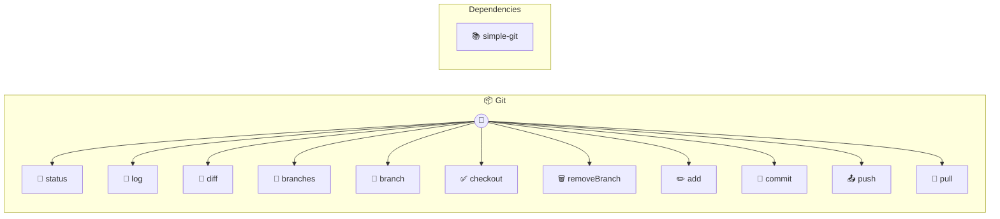

# Git

Local git repository operations

> **11 tools** · API Photon · v1.0.0 · MIT


## ⚙️ Configuration


| Variable | Required | Type | Description |
|----------|----------|------|-------------|
| `GIT_REPOPATH` | No | string | No description available (default: `process.cwd()`) |


## 🔧 Tools


### `status`

Get repository status


| Parameter | Type | Required | Description |
|-----------|------|----------|-------------|
| `path` | any | Yes | Repository path {@default .} |


---


### `log`

View commit history


| Parameter | Type | Required | Description |
|-----------|------|----------|-------------|
| `path` | any | Yes | Repository path {@default .} |
| `maxCount` | number | No | Maximum commits {@default 10} [min: 1, max: 100] |
| `branch` | string } | No | Branch name (e.g. `main`) |


---


### `diff`

Show differences


| Parameter | Type | Required | Description |
|-----------|------|----------|-------------|
| `path` | any | Yes | Repository path {@default .} |
| `staged` | boolean | No | Show staged changes only {@default false} |
| `file` | string } | No | Specific file to diff |


---


### `branches`

List all branches


| Parameter | Type | Required | Description |
|-----------|------|----------|-------------|
| `path` | any | Yes | Repository path {@default .} |


---


### `branch`

Create a branch


| Parameter | Type | Required | Description |
|-----------|------|----------|-------------|
| `name` | string | Yes | Branch name (e.g. `feature/new-feature`) |
| `path` | string | No | Repository path {@default .} |
| `checkout` | boolean | No | Checkout after creation {@default false} |


---


### `checkout`

Switch to a branch


| Parameter | Type | Required | Description |
|-----------|------|----------|-------------|
| `name` | string | Yes | Branch name (e.g. `main`) |
| `path` | string | No | Repository path {@default .} |


---


### `removeBranch`

Delete a branch


| Parameter | Type | Required | Description |
|-----------|------|----------|-------------|
| `name` | string | Yes | Branch name to delete [min: 1, max: 200] (e.g. `old-feature`) |
| `path` | string | No | Repository path [max: 500] |
| `force` | boolean | No | Force delete even if not fully merged |


---


### `add`

Stage files for commit


| Parameter | Type | Required | Description |
|-----------|------|----------|-------------|
| `files` | string[] | Yes | Array of file paths to stage (use '.' for all files) [min: 1] (e.g. `["src/index.ts","README.md"]`) |
| `path` | string | No | Repository path [max: 500] |


---


### `commit`

Create a commit


| Parameter | Type | Required | Description |
|-----------|------|----------|-------------|
| `message` | string | Yes | Commit message [min: 1, max: 500] (e.g. `fix: resolve authentication bug`) |
| `path` | string | No | Repository path [max: 500] |
| `author` | string | No | Optional author override (format: "Name <email>") [max: 200] |


---


### `push`

Push commits to remote repository


| Parameter | Type | Required | Description |
|-----------|------|----------|-------------|
| `path` | any | No | Repository path [max: 500] |
| `remote` | string | No | Remote name [max: 200] (e.g. `origin`) |
| `branch` | string | No | Branch name [max: 200] (e.g. `main`) |
| `force` | boolean } | No | Force push |


---


### `pull`

Pull changes from remote repository


| Parameter | Type | Required | Description |
|-----------|------|----------|-------------|
| `path` | any | No | Repository path [max: 500] |
| `remote` | string | No | Remote name [max: 200] (e.g. `origin`) |
| `branch` | string } | No | Branch name [max: 200] (e.g. `main`) |


---


## 🏗️ Architecture




## 📥 Usage

```bash
# Install from marketplace
photon add git

# Get MCP config for your client
photon info git --mcp
```

## 📦 Dependencies


```
simple-git@^3.21.0
```

---

MIT · v1.0.0 · Portel
