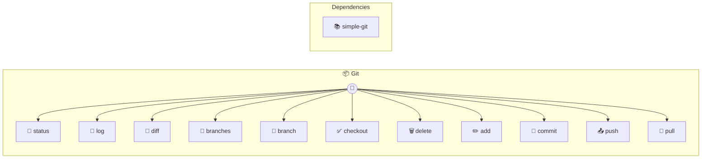

# Git

Local git repository operations

> **11 tools** · API Photon · v1.0.0 · MIT


## ⚙️ Configuration


| Variable | Required | Type | Description |
|----------|----------|------|-------------|
| `GIT_REPOPATH` | No | string | No description available |


## 📋 Quick Reference

| Method | Description |
|--------|-------------|
| `status` | Get repository status |
| `log` | View commit history |
| `diff` | Show differences |
| `branches` | List all branches |
| `branch` | Create a branch |
| `checkout` | Switch to a branch |
| `delete` | Delete a branch |
| `add` | Stage files for commit |
| `commit` | Create a commit |
| `push` | Push commits to remote |
| `pull` | Pull changes from remote |


## 🔧 Tools


### `status`

Get repository status


| Parameter | Type | Required | Description |
|-----------|------|----------|-------------|
| `path` | any | Yes | Repository path {@default .} |


---


### `log`

View commit history


| Parameter | Type | Required | Description |
|-----------|------|----------|-------------|
| `path` | any | Yes | Repository path {@default .} |
| `maxCount` | number | No | Maximum commits {@default 10} [min: 1, max: 100] |
| `branch` | string } | No | Branch name (e.g. `main`) |


---


### `diff`

Show differences


| Parameter | Type | Required | Description |
|-----------|------|----------|-------------|
| `path` | any | Yes | Repository path {@default .} |
| `staged` | boolean | No | Show staged changes only {@default false} |
| `file` | string } | No | Specific file to diff |


---


### `branches`

List all branches


| Parameter | Type | Required | Description |
|-----------|------|----------|-------------|
| `path` | any | Yes | Repository path {@default .} |


---


### `branch`

Create a branch


| Parameter | Type | Required | Description |
|-----------|------|----------|-------------|
| `name` | string | Yes | Branch name (e.g. `feature/new-feature`) |
| `path` | string | No | Repository path {@default .} |
| `checkout` | boolean | No | Checkout after creation {@default false} |


---


### `checkout`

Switch to a branch


| Parameter | Type | Required | Description |
|-----------|------|----------|-------------|
| `name` | string | Yes | Branch name (e.g. `main`) |
| `path` | string | No | Repository path {@default .} |


---


### `delete`

Delete a branch


| Parameter | Type | Required | Description |
|-----------|------|----------|-------------|
| `name` | string | Yes | Branch name (e.g. `old-feature`) |
| `path` | string | No | Repository path {@default .} |
| `force` | boolean | No | Force delete if unmerged {@default false} |


---


### `add`

Stage files for commit


| Parameter | Type | Required | Description |
|-----------|------|----------|-------------|
| `files` | string[] | Yes | File paths to stage (e.g. `["src/index.ts","README.md"]`) |
| `path` | string | No | Repository path {@default .} |


---


### `commit`

Create a commit


| Parameter | Type | Required | Description |
|-----------|------|----------|-------------|
| `message` | string | Yes | Commit message (e.g. `fix: resolve authentication bug`) |
| `path` | string | No | Repository path {@default .} |
| `author` | string | No | Author override (format: "Name <email>") |


---


### `push`

Push commits to remote


| Parameter | Type | Required | Description |
|-----------|------|----------|-------------|
| `path` | any | Yes | Repository path {@default .} |
| `remote` | string | No | Remote name {@default origin} |
| `branch` | string | No | Branch name (current if omitted) |
| `force` | boolean } | No | Force push {@default false} |


---


### `pull`

Pull changes from remote


| Parameter | Type | Required | Description |
|-----------|------|----------|-------------|
| `path` | any | Yes | Repository path {@default .} |
| `remote` | string | No | Remote name {@default origin} |
| `branch` | string } | No | Branch name (current if omitted) |


---


## 🏗️ Architecture


```mermaid
flowchart LR
    subgraph git["📦 Git"]
        direction TB
        PHOTON((🎯))
        T0[🔧 status]
        PHOTON --> T0
        T1[🔧 log]
        PHOTON --> T1
        T2[🔧 diff]
        PHOTON --> T2
        T3[🔧 branches]
        PHOTON --> T3
        T4[🔧 branch]
        PHOTON --> T4
        T5[✅ checkout]
        PHOTON --> T5
        T6[🗑️ delete]
        PHOTON --> T6
        T7[✏️ add]
        PHOTON --> T7
        T8[🔧 commit]
        PHOTON --> T8
        T9[📤 push]
        PHOTON --> T9
        T10[🔧 pull]
        PHOTON --> T10
    end

    subgraph deps["Dependencies"]
        direction TB
        NPM0[📚 simple-git]
    end
```


## 📥 Usage

```bash
# Install from marketplace
photon add git

# Get MCP config for your client
photon info git --mcp
```

## 📦 Dependencies


```
simple-git@^3.21.0
```

---

MIT · v1.0.0 · Portel
