# Git

Local git repository operations

> **11 tools** · API Photon · v1.0.0 · MIT


## ⚙️ Configuration


| Variable | Required | Type | Description |
|----------|----------|------|-------------|
| `GIT_REPOPATH` | No | string | Default repository path (default: current directory) (default: `process.cwd()`) |


### Setup Instructions

- repoPath: Default repository path (default: current directory)


## 🔧 Tools


### `status`

Get git status of repository


| Parameter | Type | Required | Description |
|-----------|------|----------|-------------|
| `path` | any | No | Repository path |


---


### `log`

View commit history


| Parameter | Type | Required | Description |
|-----------|------|----------|-------------|
| `path` | any | No | Repository path [max: 500] |
| `maxCount` | number | No | Maximum number of commits to retrieve [min: 1, max: 100] |
| `branch` | string } | No | Branch name to get logs from [max: 200] (e.g. `main`) |


---


### `diff`

Show differences in repository


| Parameter | Type | Required | Description |
|-----------|------|----------|-------------|
| `path` | any | No | Repository path [max: 500] |
| `staged` | boolean | No | Show staged changes only |
| `file` | string } | No | Specific file to show diff for [max: 500] |


---


### `branches`

List all branches in repository


| Parameter | Type | Required | Description |
|-----------|------|----------|-------------|
| `path` | any | No | Repository path |


---


### `branch`

Create a new branch


| Parameter | Type | Required | Description |
|-----------|------|----------|-------------|
| `name` | string | Yes | Branch name to create [min: 1, max: 200] (e.g. `feature/new-feature`) |
| `path` | string | No | Repository path [max: 500] |
| `checkout` | boolean | No | Checkout the new branch after creation |


---


### `checkout`

Checkout (switch to) a branch


| Parameter | Type | Required | Description |
|-----------|------|----------|-------------|
| `name` | string | Yes | Branch name to checkout [min: 1, max: 200] (e.g. `main`) |
| `path` | string | No | Repository path [max: 500] |


---


### `removeBranch`

Delete a branch


| Parameter | Type | Required | Description |
|-----------|------|----------|-------------|
| `name` | string | Yes | Branch name to delete [min: 1, max: 200] (e.g. `old-feature`) |
| `path` | string | No | Repository path [max: 500] |
| `force` | boolean | No | Force delete even if not fully merged |


---


### `add`

Stage files for commit


| Parameter | Type | Required | Description |
|-----------|------|----------|-------------|
| `files` | string[] | Yes | Array of file paths to stage (use '.' for all files) [min: 1] (e.g. `["src/index.ts","README.md"]`) |
| `path` | string | No | Repository path [max: 500] |


---


### `commit`

Create a commit


| Parameter | Type | Required | Description |
|-----------|------|----------|-------------|
| `message` | string | Yes | Commit message [min: 1, max: 500] (e.g. `fix: resolve authentication bug`) |
| `path` | string | No | Repository path [max: 500] |
| `author` | string | No | Optional author override (format: "Name <email>") [max: 200] |


---


### `push`

Push commits to remote repository


| Parameter | Type | Required | Description |
|-----------|------|----------|-------------|
| `path` | any | No | Repository path [max: 500] |
| `remote` | string | No | Remote name [max: 200] (e.g. `origin`) |
| `branch` | string | No | Branch name [max: 200] (e.g. `main`) |
| `force` | boolean } | No | Force push |


---


### `pull`

Pull changes from remote repository


| Parameter | Type | Required | Description |
|-----------|------|----------|-------------|
| `path` | any | No | Repository path [max: 500] |
| `remote` | string | No | Remote name [max: 200] (e.g. `origin`) |
| `branch` | string } | No | Branch name [max: 200] (e.g. `main`) |


---


## 🏗️ Architecture

```mermaid
flowchart LR
    subgraph git["📦 Git"]
        direction TB
        PHOTON((🎯))
        T0[🔧 status]
        PHOTON --> T0
        T1[🔧 log]
        PHOTON --> T1
        T2[🔧 diff]
        PHOTON --> T2
        T3[🔧 branches]
        PHOTON --> T3
        T4[🔧 branch]
        PHOTON --> T4
        T5[✅ checkout]
        PHOTON --> T5
        T6[🗑️ removeBranch]
        PHOTON --> T6
        T7[✏️ add]
        PHOTON --> T7
        T8[🔧 commit]
        PHOTON --> T8
        T9[📤 push]
        PHOTON --> T9
        T10[🔧 pull]
        PHOTON --> T10
    end

    subgraph deps["Dependencies"]
        direction TB
        NPM0[📚 simple-git]
    end
```




## 📥 Usage

```bash
# Install from marketplace
photon add git

# Get MCP config for your client
photon info git --mcp
```

## 📦 Dependencies


```
simple-git@^3.21.0
```

---

MIT · v1.0.0 · Portel
