# GitHub Issues

Manage GitHub repository issues

> **7 tools** · API Photon · v1.1.0 · MIT


## ⚙️ Configuration


| Variable | Required | Type | Description |
|----------|----------|------|-------------|
| `GIT_HUB_ISSUES_TOKEN` | Yes | string | GitHub personal access token (required) |
| `GIT_HUB_ISSUES_BASEURL` | No | string | GitHub API base URL (default: https://api.github.com) (default: `https://api.github.com`) |


### Setup Instructions

- token: GitHub personal access token (required)
- baseUrl: GitHub API base URL (default: https://api.github.com)
Dependencies are auto-installed on first run.


## 🔧 Tools


### `listIssues`

List issues in a repository


| Parameter | Type | Required | Description |
|-----------|------|----------|-------------|
| `owner` | any | Yes | Repository owner (username or organization) |
| `repo` | any | Yes | Repository name |
| `state` | any | No | Issue state filter |
| `labels` | any | Yes | Comma-separated label names to filter by |
| `sort` | any | No | Sort by created, updated, or comments |
| `per_page` | any | No | Number of results per page |


---


### `getIssue`

Get a single issue by number


| Parameter | Type | Required | Description |
|-----------|------|----------|-------------|
| `owner` | any | Yes | Repository owner |
| `repo` | any | Yes | Repository name |
| `issue_number` | any | Yes | Issue number |


---


### `createIssue`

Create a new issue


| Parameter | Type | Required | Description |
|-----------|------|----------|-------------|
| `owner` | any | Yes | Repository owner |
| `repo` | any | Yes | Repository name |
| `title` | any | Yes | Issue title |
| `body` | any | Yes | Issue description/body |
| `labels` | any | Yes | Array of label names |
| `assignees` | any | Yes | Array of usernames to assign |


---


### `updateIssue`

Update an existing issue


| Parameter | Type | Required | Description |
|-----------|------|----------|-------------|
| `owner` | any | Yes | Repository owner |
| `repo` | any | Yes | Repository name |
| `issue_number` | any | Yes | Issue number to update |
| `title` | any | No | New title |
| `body` | any | No | New body |
| `state` | any | No | New state: open or closed |
| `labels` | any | No | New labels |


---


### `addComment`

Add a comment to an issue


| Parameter | Type | Required | Description |
|-----------|------|----------|-------------|
| `owner` | any | Yes | Repository owner |
| `repo` | any | Yes | Repository name |
| `issue_number` | any | Yes | Issue number |
| `body` | any | Yes | Comment text |


---


### `listComments`

List comments on an issue


| Parameter | Type | Required | Description |
|-----------|------|----------|-------------|
| `owner` | any | Yes | Repository owner |
| `repo` | any | Yes | Repository name |
| `issue_number` | any | Yes | Issue number |


---


### `searchIssues`

Search issues across repositories


| Parameter | Type | Required | Description |
|-----------|------|----------|-------------|
| `query` | any | Yes | Search query (e.g., "is:open label:bug") |
| `sort` | any | No | Sort by created, updated, or comments |
| `order` | any | No | Sort order: asc or desc |
| `per_page` | any | No | Number of results per page |


---


## 🏗️ Architecture

```mermaid
flowchart LR
    subgraph github_issues["📦 Github Issues"]
        direction TB
        PHOTON((🎯))
        T0[📖 listIssues]
        PHOTON --> T0
        T1[📖 getIssue]
        PHOTON --> T1
        T2[✏️ createIssue]
        PHOTON --> T2
        T3[🔄 updateIssue]
        PHOTON --> T3
        T4[✏️ addComment]
        PHOTON --> T4
        T5[📖 listComments]
        PHOTON --> T5
        T6[📖 searchIssues]
        PHOTON --> T6
    end
```




## 📥 Usage

```bash
# Install from marketplace
photon add github-issues

# Get MCP config for your client
photon get github-issues --mcp
```

## 📦 Dependencies


```
@octokit/rest@^20.0.0
```

---

MIT · v1.1.0 · Portel
