# GitHub Issues

Manage repository issues

> **7 tools** · API Photon · v1.1.0 · MIT


## ⚙️ Configuration


| Variable | Required | Type | Description |
|----------|----------|------|-------------|
| `GIT_HUB_ISSUES_PHOTON_TOKEN` | Yes | string | No description available |
| `GIT_HUB_ISSUES_PHOTON_BASEURL` | No | string | No description available (default: `https://api.github.com`) |


## 🔧 Tools


### `list`

List issues


| Parameter | Type | Required | Description |
|-----------|------|----------|-------------|
| `owner` | string | Yes | Repository owner |
| `repo` | string | Yes | Repository name |
| `state` | 'open' | 'closed' | 'all' | No | Filter {@default open} [choice: open,closed,all] |
| `labels` | string | No | Filter labels (comma-separated) |
| `sort` | 'created' | 'updated' | 'comments' | No | Sort by {@default created} [choice: created,updated,comments] |
| `limit` | number | No | Results [min: 1, max: 100] |


---


### `get`

Get issue


| Parameter | Type | Required | Description |
|-----------|------|----------|-------------|
| `owner` | string | Yes | Repository owner |
| `repo` | string | Yes | Repository name |
| `number` | number | Yes | Issue number |


---


### `create`

Create issue


| Parameter | Type | Required | Description |
|-----------|------|----------|-------------|
| `owner` | string | Yes | Repository owner |
| `repo` | string | Yes | Repository name |
| `title` | string | Yes | Issue title |
| `body` | string | No | Description [field: textarea] |
| `labels` | string[] | No | Label names (JSON array, optional) |
| `assignees` | string[] | No | Assignees (JSON array, optional) |


---


### `update`

Update issue


| Parameter | Type | Required | Description |
|-----------|------|----------|-------------|
| `owner` | string | Yes | Repository owner |
| `repo` | string | Yes | Repository name |
| `number` | number | Yes | Issue number |
| `title` | string | No | New title |
| `body` | string | No | New description [field: textarea] |
| `state` | 'open' | 'closed' | No | New state [choice: open,closed] |
| `labels` | string[] | No | New labels (JSON array, optional) |


---


### `comment`

Add comment


| Parameter | Type | Required | Description |
|-----------|------|----------|-------------|
| `owner` | string | Yes | Repository owner |
| `repo` | string | Yes | Repository name |
| `number` | number | Yes | Issue number |
| `body` | string | Yes | Comment text [field: textarea] |


---


### `comments`

List comments


| Parameter | Type | Required | Description |
|-----------|------|----------|-------------|
| `owner` | string | Yes | Repository owner |
| `repo` | string | Yes | Repository name |
| `number` | number | Yes | Issue number |


---


### `search`

Search issues


| Parameter | Type | Required | Description |
|-----------|------|----------|-------------|
| `query` | string | Yes | Search query |
| `sort` | 'created' | 'updated' | 'comments' | No | Sort by [choice: created,updated,comments] |
| `order` | 'asc' | 'desc' | No | Order {@default desc} [choice: asc,desc] |
| `limit` | number | No | Results [min: 1, max: 100] |


---


## 🏗️ Architecture

```mermaid
flowchart LR
    subgraph github_issues["📦 Github Issues"]
        direction TB
        PHOTON((🎯))
        T0[📖 list]
        PHOTON --> T0
        T1[📖 get]
        PHOTON --> T1
        T2[✏️ create]
        PHOTON --> T2
        T3[🔄 update]
        PHOTON --> T3
        T4[🔧 comment]
        PHOTON --> T4
        T5[🔧 comments]
        PHOTON --> T5
        T6[📖 search]
        PHOTON --> T6
    end
```




## 📥 Usage

```bash
# Install from marketplace
photon add github-issues

# Get MCP config for your client
photon info github-issues --mcp
```

## 📦 Dependencies


```
@octokit/rest@^20.0.0
```

---

MIT · v1.1.0 · Portel
