# Google Calendar

Calendar integration

> **9 tools** · API Photon · v1.0.0 · MIT


## ⚙️ Configuration


| Variable | Required | Type | Description |
|----------|----------|------|-------------|
| `GOOGLE_CALENDAR_CLIENTID` | Yes | string | OAuth2 client ID from Google Cloud Console |
| `GOOGLE_CALENDAR_CLIENTSECRET` | Yes | string | OAuth2 client secret |
| `GOOGLE_CALENDAR_REFRESHTOKEN` | Yes | string | OAuth2 refresh token (obtain via OAuth flow) |


### Setup Instructions

- clientId: OAuth2 client ID from Google Cloud Console
- clientSecret: OAuth2 client secret
- refreshToken: OAuth2 refresh token (obtain via OAuth flow)


## 🔧 Tools


### `list`

List upcoming events


| Parameter | Type | Required | Description |
|-----------|------|----------|-------------|
| `calendarId` | any | No | Calendar ID [max: 200] (e.g. `primary`) |
| `maxResults` | number | No | Maximum number of events to return [min: 1, max: 100] |
| `timeMin` | string | No | Start time (ISO 8601, default: now) [format: date-time] (e.g. `2024-03-15T09:00:00Z`) |
| `timeMax` | string | No | End time (ISO 8601, optional) [format: date-time] (e.g. `2024-03-20T18:00:00Z`) |


---


### `get`

Get a specific event


| Parameter | Type | Required | Description |
|-----------|------|----------|-------------|
| `eventId` | string | Yes | Event ID [min: 1, max: 200] (e.g. `abc123def456ghi789`) |
| `calendarId` | string | No | Calendar ID [max: 200] (e.g. `primary`) |


---


### `create`

Create a new event


| Parameter | Type | Required | Description |
|-----------|------|----------|-------------|
| `summary` | string | Yes | Event title [min: 1, max: 200] (e.g. `Team Meeting`) |
| `start` | string | Yes | Start time (ISO 8601) [min: 1, format: date-time] (e.g. `2024-03-15T14:00:00Z`) |
| `end` | string | Yes | End time (ISO 8601) [min: 1, format: date-time] (e.g. `2024-03-15T15:00:00Z`) |
| `description` | string | No | Event description [max: 5000] (e.g. `Quarterly planning session`) |
| `location` | string | No | Event location [max: 500] (e.g. `Conference Room A`) |
| `attendees` | string[] | No | Array of attendee email addresses [min: 1] (e.g. `["user@example.com","colleague@company.com"]`) |
| `calendarId` | string | No | Calendar ID [max: 200] (e.g. `primary`) |


---


### `update`

Update an existing event


| Parameter | Type | Required | Description |
|-----------|------|----------|-------------|
| `eventId` | string | Yes | Event ID [min: 1, max: 200] (e.g. `abc123def456ghi789`) |
| `updates` | any | Yes | Object containing fields to update |
| `calendarId` | any | No | Calendar ID [max: 200] (e.g. `primary`) |


---


### `remove`

Delete an event


| Parameter | Type | Required | Description |
|-----------|------|----------|-------------|
| `eventId` | string | Yes | Event ID [min: 1, max: 200] (e.g. `abc123def456ghi789`) |
| `calendarId` | string | No | Calendar ID [max: 200] (e.g. `primary`) |


---


### `calendars`

List all calendars


---


### `freeBusy`

Check free/busy status


| Parameter | Type | Required | Description |
|-----------|------|----------|-------------|
| `emails` | string[] | Yes | Array of email addresses to check [min: 1] (e.g. `["user@example.com","colleague@company.com"]`) |
| `timeMin` | string | Yes | Start time (ISO 8601) [min: 1, format: date-time] (e.g. `2024-03-15T09:00:00Z`) |
| `timeMax` | string | Yes | End time (ISO 8601) [min: 1, format: date-time] (e.g. `2024-03-15T18:00:00Z`) |


---


### `search`

Search for events


| Parameter | Type | Required | Description |
|-----------|------|----------|-------------|
| `query` | string | Yes | Search query [min: 1, max: 500] (e.g. `team meeting`) |
| `calendarId` | string | No | Calendar ID [max: 200] (e.g. `primary`) |
| `maxResults` | number | No | Maximum number of results [min: 1, max: 100] |


---


### `upcoming`

Get upcoming events within specified hours


| Parameter | Type | Required | Description |
|-----------|------|----------|-------------|
| `hours` | any | No | Number of hours from now [min: 1, max: 720] (e.g. `48`) |
| `calendarId` | string } | No | Calendar ID [max: 200] (e.g. `primary`) |


---


## 🏗️ Architecture

```mermaid
flowchart LR
    subgraph google_calendar["📦 Google Calendar"]
        direction TB
        PHOTON((🎯))
        T0[📖 list]
        PHOTON --> T0
        T1[📖 get]
        PHOTON --> T1
        T2[✏️ create]
        PHOTON --> T2
        T3[🔄 update]
        PHOTON --> T3
        T4[🗑️ remove]
        PHOTON --> T4
        T5[🔧 calendars]
        PHOTON --> T5
        T6[🔧 freeBusy]
        PHOTON --> T6
        T7[📖 search]
        PHOTON --> T7
        T8[🔧 upcoming]
        PHOTON --> T8
    end

    subgraph deps["Dependencies"]
        direction TB
        NPM0[📚 googleapis]
    end
```




## 📥 Usage

```bash
# Install from marketplace
photon add google-calendar

# Get MCP config for your client
photon info google-calendar --mcp
```

## 📦 Dependencies


```
googleapis@^128.0.0
```

---

MIT · v1.0.0 · Portel
