# Google Calendar

Schedule and manage events

> **9 tools** · API Photon · v1.0.0 · MIT


## ⚙️ Configuration


| Variable | Required | Type | Description |
|----------|----------|------|-------------|
| `GOOGLE_CALENDAR_PHOTON_CLIENTID` | Yes | string | No description available |
| `GOOGLE_CALENDAR_PHOTON_CLIENTSECRET` | Yes | string | No description available |
| `GOOGLE_CALENDAR_PHOTON_REFRESHTOKEN` | Yes | string | No description available |


## 📋 Quick Reference

| Method | Description |
|--------|-------------|
| `list` | List events |
| `get` | Get event |
| `create` | Create event |
| `update` | Update event |
| `remove` | Delete event |
| `calendars` | List calendars |
| `availability` | Check free/busy |
| `search` | Search events |
| `upcoming` | Get upcoming (within N hours) |


## 🔧 Tools


### `list`

List events


| Parameter | Type | Required | Description |
|-----------|------|----------|-------------|
| `calendar` | any | No | Calendar ID |
| `limit` | number | No | Results [min: 1, max: 100] |
| `from` | string | No | Start time (ISO 8601, optional) |
| `to` | string | No | End time (ISO 8601, optional) |


---


### `get`

Get event


| Parameter | Type | Required | Description |
|-----------|------|----------|-------------|
| `id` | string | Yes | Event ID |
| `calendar` | string | No | Calendar ID |


---


### `create`

Create event


| Parameter | Type | Required | Description |
|-----------|------|----------|-------------|
| `summary` | string | Yes | Title |
| `start` | string | Yes | Start time (ISO 8601) (e.g. `2024-03-15T14:00:00Z`) |
| `end` | string | Yes | End time (ISO 8601) (e.g. `2024-03-15T15:00:00Z`) |
| `description` | string | No | Description [field: textarea] |
| `location` | string | No | Location |
| `attendees` | string[] | No | Attendee emails (JSON array, optional) |
| `calendar` | string | No | Calendar ID |


---


### `update`

Update event


| Parameter | Type | Required | Description |
|-----------|------|----------|-------------|
| `id` | string | Yes | Event ID |
| `updates` | any | Yes | Fields to update (JSON object) |
| `calendar` | any | No | Calendar ID |


---


### `remove`

Delete event


| Parameter | Type | Required | Description |
|-----------|------|----------|-------------|
| `id` | string | Yes | Event ID |
| `calendar` | string | No | Calendar ID |


---


### `calendars`

List calendars


---


### `availability`

Check free/busy


| Parameter | Type | Required | Description |
|-----------|------|----------|-------------|
| `emails` | string[] | Yes | Email addresses (JSON array) |
| `from` | string | Yes | Start time (ISO 8601) |
| `to` | string | Yes | End time (ISO 8601) |


---


### `search`

Search events


| Parameter | Type | Required | Description |
|-----------|------|----------|-------------|
| `query` | string | Yes | Search terms |
| `calendar` | string | No | Calendar ID |
| `limit` | number | No | Results [min: 1, max: 100] |


---


### `upcoming`

Get upcoming (within N hours)


| Parameter | Type | Required | Description |
|-----------|------|----------|-------------|
| `hours` | any | No | Hours ahead [min: 1, max: 720] |
| `calendar` | string } | No | Calendar ID |


---


## 🏗️ Architecture

```mermaid
flowchart LR
    subgraph google_calendar["📦 Google Calendar"]
        direction TB
        PHOTON((🎯))
        T0[📖 list]
        PHOTON --> T0
        T1[📖 get]
        PHOTON --> T1
        T2[✏️ create]
        PHOTON --> T2
        T3[🔄 update]
        PHOTON --> T3
        T4[🗑️ remove]
        PHOTON --> T4
        T5[🔧 calendars]
        PHOTON --> T5
        T6[🔧 availability]
        PHOTON --> T6
        T7[📖 search]
        PHOTON --> T7
        T8[🔧 upcoming]
        PHOTON --> T8
    end

    subgraph deps["Dependencies"]
        direction TB
        NPM0[📚 googleapis]
    end
```




## 📥 Usage

```bash
# Install from marketplace
photon add google-calendar

# Get MCP config for your client
photon info google-calendar --mcp
```

## 📦 Dependencies


```
googleapis@^128.0.0
```

---

MIT · v1.0.0 · Portel
