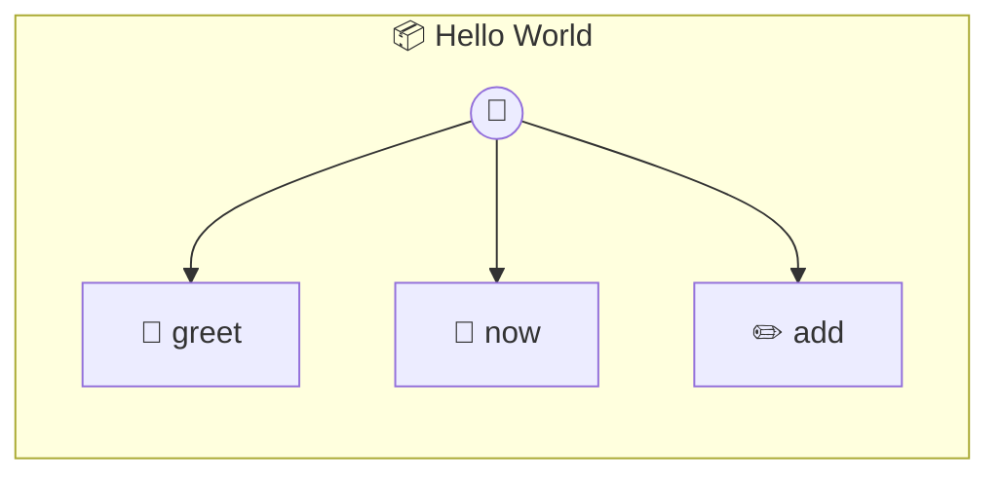

# Hello World

The simplest possible photon A photon is just a TypeScript class where each method becomes an MCP tool.

> **3 tools** · API Photon · v1.0.0 · MIT


## ⚙️ Configuration

No configuration required.


## 🔧 Tools


### `greet`

Say hello to someone


| Parameter | Type | Required | Description |
|-----------|------|----------|-------------|
| `name` | string = 'World' | Yes | - (e.g. `Alice`) |


---


### `now`

Get current time and greeting


---


### `add`

Add two numbers


| Parameter | Type | Required | Description |
|-----------|------|----------|-------------|
| `a` | any | Yes | - (e.g. `5`) |
| `b` | number } | Yes | - (e.g. `3`) |


---


## 🏗️ Architecture


```mermaid
flowchart LR
    subgraph hello_world["📦 Hello World"]
        direction TB
        PHOTON((🎯))
        T0[🔧 greet]
        PHOTON --> T0
        T1[🔧 now]
        PHOTON --> T1
        T2[✏️ add]
        PHOTON --> T2
    end
```


## 📥 Usage

```bash
# Install from marketplace
photon add hello-world

# Get MCP config for your client
photon info hello-world --mcp
```

## 📦 Dependencies

No external dependencies.

---

MIT · v1.0.0 · Portel
