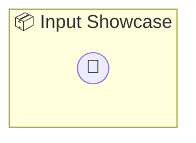

# Input Showcase

Input Showcase

> **0 tools** · API Photon · v1.9.0 · MIT


## ⚙️ Configuration

No configuration required.


## 🔧 Tools


No tools defined.


## 🏗️ Architecture




## 📥 Usage

```bash
# Install from marketplace
photon add input-showcase

# Get MCP config for your client
photon info input-showcase --mcp
```

## 📦 Dependencies

No external dependencies.

---

MIT · v1.9.0
