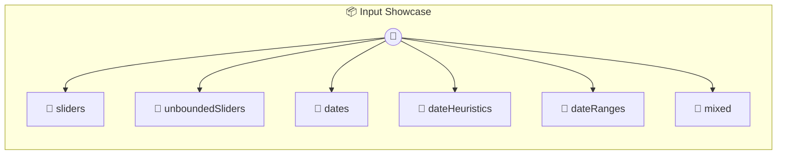

# Input Showcase

Input Showcase

> **6 tools** · API Photon · v1.18.0 · MIT


## ⚙️ Configuration

No configuration required.


## 📋 Quick Reference

| Method | Description |
|--------|-------------|
| `sliders` | Test slider with explicit min/max bounds |
| `unboundedSliders` | Test slider with partial or no bounds |
| `dates` | Test date inputs with |
| `dateHeuristics` | Test date detection by key name heuristic |
| `dateRanges` | Test date range and datetime range |
| `mixed` | Test mixed inputs in a single form |


## 🔧 Tools


### `sliders`

Test slider with explicit min/max bounds


| Parameter | Type | Required | Description |
|-----------|------|----------|-------------|
| `count` | number | Yes | Number of items [min: 1, max: 50] |
| `rating` | number | Yes | Quality rating {@multipleOf 0.5} [min: 0, max: 5] |
| `temperature` | number | Yes | Temperature value {@min -20} [max: 45] |


---


### `unboundedSliders`

Test slider with partial or no bounds


| Parameter | Type | Required | Description |
|-----------|------|----------|-------------|
| `unbounded` | number | Yes | A number with no constraints |
| `minOnly` | number | Yes | Only has a minimum [min: 10] |
| `maxOnly` | number | Yes | Only has a maximum [max: 500] |
| `percentage` | number | Yes | A float between 0 and 1 |


---


### `dates`

Test date inputs with


| Parameter | Type | Required | Description |
|-----------|------|----------|-------------|
| `date` | string | Yes | Pick a date [format: date] |
| `eventStart` | string | Yes | Event start time [format: date-time] |
| `alarmTime` | string | Yes | Daily alarm [format: time] |


---


### `dateHeuristics`

Test date detection by key name heuristic


| Parameter | Type | Required | Description |
|-----------|------|----------|-------------|
| `deadline` | string | Yes | Project deadline |
| `birthday` | string | Yes | Your birthday |
| `startTime` | string | Yes | Meeting start time |


---


### `dateRanges`

Test date range and datetime range


| Parameter | Type | Required | Description |
|-----------|------|----------|-------------|
| `period` | { start: string | Yes | Report period [format: date-range] |
| `window` | any | Yes | Event window [format: datetime-range] |


---


### `mixed`

Test mixed inputs in a single form


| Parameter | Type | Required | Description |
|-----------|------|----------|-------------|
| `name` | string | Yes | Event name |
| `attendees` | number | Yes | Number of attendees [min: 1, max: 1000] |
| `date` | string | Yes | Event date [format: date] |
| `duration` | number | Yes | Hours {@min 0.5} {@multipleOf 0.5} [max: 24] |
| `priority` | string | Yes | Priority level (low, medium, high) |


---


## 🏗️ Architecture


```mermaid
flowchart LR
    subgraph input_showcase["📦 Input Showcase"]
        direction TB
        PHOTON((🎯))
        T0[🔧 sliders]
        PHOTON --> T0
        T1[🔧 unboundedSliders]
        PHOTON --> T1
        T2[🔧 dates]
        PHOTON --> T2
        T3[🔧 dateHeuristics]
        PHOTON --> T3
        T4[🔧 dateRanges]
        PHOTON --> T4
        T5[🔧 mixed]
        PHOTON --> T5
    end
```


## 📥 Usage

```bash
# Install from marketplace
photon add input-showcase

# Get MCP config for your client
photon info input-showcase --mcp
```

## 📦 Dependencies

No external dependencies.

---

MIT · v1.18.0
