# Jira

Issue tracking and project management

> **10 tools** · API Photon · v1.0.0 · MIT


## ⚙️ Configuration


| Variable | Required | Type | Description |
|----------|----------|------|-------------|
| `JIRA_PHOTON_HOST` | Yes | string | No description available |
| `JIRA_PHOTON_EMAIL` | Yes | string | No description available |
| `JIRA_PHOTON_APITOKEN` | Yes | string | No description available |


## 📋 Quick Reference

| Method | Description |
|--------|-------------|
| `search` | Search issues (JQL) |
| `get` | Get issue |
| `create` | Create issue |
| `update` | Update issue |
| `transition` | Transition issue |
| `transitions` | Get transitions |
| `comment` | Add comment |
| `comments` | List comments |
| `projects` | List projects |
| `project` | Get project |


## 🔧 Tools


### `search`

Search issues (JQL)


| Parameter | Type | Required | Description |
|-----------|------|----------|-------------|
| `jql` | string | Yes | JQL query (e.g. `project = PROJ AND status = Open`) |
| `limit` | number | No | Results [min: 1, max: 100] |
| `fields` | string | No | Fields to return (comma-separated, optional) |


---


### `get`

Get issue


| Parameter | Type | Required | Description |
|-----------|------|----------|-------------|
| `key` | string | Yes | Issue key (e.g. `PROJ-123`) |


---


### `create`

Create issue


| Parameter | Type | Required | Description |
|-----------|------|----------|-------------|
| `project` | string | Yes | Project key (e.g. `PROJ`) |
| `summary` | string | Yes | Title |
| `issueType` | string | Yes | Type (e.g. `Bug`) |
| `description` | string | No | Description [field: textarea] |
| `priority` | string | No | Priority (e.g. `High`) |
| `assignee` | string | No | Assignee ID |


---


### `update`

Update issue


| Parameter | Type | Required | Description |
|-----------|------|----------|-------------|
| `key` | string | Yes | Issue key (e.g. `PROJ-123`) |
| `summary` | string | No | New summary |
| `description` | string | No | New description [field: textarea] |
| `priority` | string | No | New priority |
| `assignee` | string | No | New assignee ID |


---


### `transition`

Transition issue


| Parameter | Type | Required | Description |
|-----------|------|----------|-------------|
| `key` | string | Yes | Issue key (e.g. `PROJ-123`) |
| `transitionId` | string | Yes | Transition ID or name |


---


### `transitions`

Get transitions


| Parameter | Type | Required | Description |
|-----------|------|----------|-------------|
| `key` | string | Yes | Issue key (e.g. `PROJ-123`) |


---


### `comment`

Add comment


| Parameter | Type | Required | Description |
|-----------|------|----------|-------------|
| `key` | string | Yes | Issue key (e.g. `PROJ-123`) |
| `text` | string | Yes | Comment text [field: textarea] |


---


### `comments`

List comments


| Parameter | Type | Required | Description |
|-----------|------|----------|-------------|
| `key` | string | Yes | Issue key (e.g. `PROJ-123`) |
| `limit` | number | No | Results [min: 1, max: 100] |


---


### `projects`

List projects


---


### `project`

Get project


| Parameter | Type | Required | Description |
|-----------|------|----------|-------------|
| `key` | string | Yes | Project key (e.g. `PROJ`) |


---


## 🏗️ Architecture

```mermaid
flowchart LR
    subgraph jira["📦 Jira"]
        direction TB
        PHOTON((🎯))
        T0[📖 search]
        PHOTON --> T0
        T1[📖 get]
        PHOTON --> T1
        T2[✏️ create]
        PHOTON --> T2
        T3[🔄 update]
        PHOTON --> T3
        T4[🔧 transition]
        PHOTON --> T4
        T5[🔧 transitions]
        PHOTON --> T5
        T6[🔧 comment]
        PHOTON --> T6
        T7[🔧 comments]
        PHOTON --> T7
        T8[🔧 projects]
        PHOTON --> T8
        T9[🔧 project]
        PHOTON --> T9
    end

    subgraph deps["Dependencies"]
        direction TB
        NPM0[📚 axios]
    end
```




## 📥 Usage

```bash
# Install from marketplace
photon add jira

# Get MCP config for your client
photon info jira --mcp
```

## 📦 Dependencies


```
axios@^1.6.0
```

---

MIT · v1.0.0 · Portel
