# Jira

Project management and issue tracking

> **10 tools** · API Photon · v1.0.0 · MIT


## ⚙️ Configuration


| Variable | Required | Type | Description |
|----------|----------|------|-------------|
| `JIRA_HOST` | Yes | string | Jira instance URL (e.g., "your-domain.atlassian.net") |
| `JIRA_EMAIL` | Yes | string | User email for authentication |
| `JIRA_APITOKEN` | Yes | string | API token from Jira (required) |


### Setup Instructions

- host: Jira instance URL (e.g., "your-domain.atlassian.net")
- email: User email for authentication
- apiToken: API token from Jira (required)


## 🔧 Tools


### `search`

List issues with JQL query


| Parameter | Type | Required | Description |
|-----------|------|----------|-------------|
| `jql` | any | Yes | JQL query string [min: 1, max: 1000] (e.g. `project = PROJ AND status = Open`) |
| `maxResults` | any | No | Maximum number of results [min: 1, max: 100] |
| `fields` | any | Yes | Fields to return (optional, comma-separated) [max: 500] (e.g. `summary,status,assignee`) |


---


### `get`

Get issue details


| Parameter | Type | Required | Description |
|-----------|------|----------|-------------|
| `issueKey` | any | Yes | Issue key [min: 1, max: 50] (e.g. `PROJ-123`) |


---


### `create`

Create a new issue


| Parameter | Type | Required | Description |
|-----------|------|----------|-------------|
| `project` | any | Yes | Project key [min: 1, max: 50] (e.g. `PROJ`) |
| `summary` | any | Yes | Issue title [min: 1, max: 200] (e.g. `Login authentication fails for users`) |
| `issueType` | any | Yes | Issue type [min: 1, max: 50] (e.g. `Bug`) |
| `description` | any | No | Issue description [max: 5000] (e.g. `Steps to reproduce: 1. Navigate to login 2. Enter credentials`) |
| `priority` | any | No | Priority name [max: 50] (e.g. `High`) |
| `assignee` | any | No | Assignee account ID [max: 100] (e.g. `5b10a2844c20165700ede21g`) |


---


### `update`

Update an issue


| Parameter | Type | Required | Description |
|-----------|------|----------|-------------|
| `issueKey` | any | Yes | Issue key [min: 1, max: 50] (e.g. `PROJ-123`) |
| `summary` | any | No | New summary [min: 1, max: 200] (e.g. `Updated: Login authentication fixed`) |
| `description` | any | No | New description [max: 5000] (e.g. `Fixed by updating OAuth configuration`) |
| `priority` | any | No | New priority [max: 50] (e.g. `Medium`) |
| `assignee` | any | No | New assignee account ID [max: 100] (e.g. `5b10a2844c20165700ede21g`) |


---


### `transition`

Transition issue to new status


| Parameter | Type | Required | Description |
|-----------|------|----------|-------------|
| `issueKey` | any | Yes | Issue key [min: 1, max: 50] (e.g. `PROJ-123`) |
| `transitionId` | any | Yes | Transition ID or name [min: 1, max: 50] (e.g. `21`) |


---


### `transitions`

Get available transitions for issue


| Parameter | Type | Required | Description |
|-----------|------|----------|-------------|
| `issueKey` | any | Yes | Issue key [min: 1, max: 50] (e.g. `PROJ-123`) |


---


### `comment`

Add comment to issue


| Parameter | Type | Required | Description |
|-----------|------|----------|-------------|
| `issueKey` | any | Yes | Issue key [min: 1, max: 50] (e.g. `PROJ-123`) |
| `comment` | any | Yes | Comment text [min: 1, max: 5000] (e.g. `This issue has been resolved in the latest deployment`) |


---


### `comments`

Get comments for issue


| Parameter | Type | Required | Description |
|-----------|------|----------|-------------|
| `issueKey` | any | Yes | Issue key [min: 1, max: 50] (e.g. `PROJ-123`) |
| `maxResults` | any | No | Maximum number of comments [min: 1, max: 100] |


---


### `projects`

List all projects


---


### `project`

Get project details


| Parameter | Type | Required | Description |
|-----------|------|----------|-------------|
| `projectKey` | any | Yes | Project key [min: 1, max: 50] (e.g. `PROJ`) |


---


## 🏗️ Architecture

```mermaid
flowchart LR
    subgraph jira["📦 Jira"]
        direction TB
        PHOTON((🎯))
        T0[📖 search]
        PHOTON --> T0
        T1[📖 get]
        PHOTON --> T1
        T2[✏️ create]
        PHOTON --> T2
        T3[🔄 update]
        PHOTON --> T3
        T4[🔧 transition]
        PHOTON --> T4
        T5[🔧 transitions]
        PHOTON --> T5
        T6[🔧 comment]
        PHOTON --> T6
        T7[🔧 comments]
        PHOTON --> T7
        T8[🔧 projects]
        PHOTON --> T8
        T9[🔧 project]
        PHOTON --> T9
    end

    subgraph deps["Dependencies"]
        direction TB
        NPM0[📚 axios]
    end
```




## 📥 Usage

```bash
# Install from marketplace
photon add jira

# Get MCP config for your client
photon get jira --mcp
```

## 📦 Dependencies


```
axios@^1.6.0
```

---

MIT · v1.0.0 · Portel
