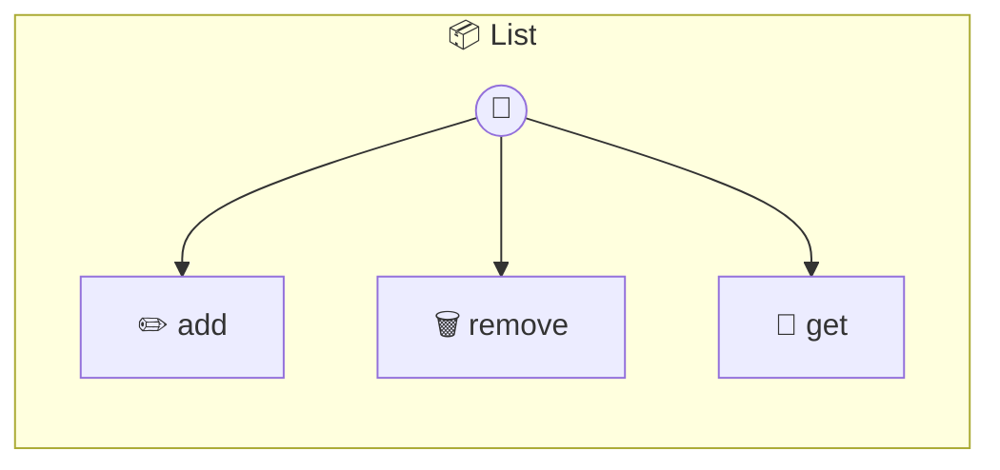

# List

List — Simple reactive list for testing state sync A minimal task list using @stateful with constructor-injected state. Perfect for testing end-to-end synchronization across clients.

> **3 tools** · API Photon · v1.0.0 · MIT

**Platform Features:** `stateful`

## ⚙️ Configuration


| Variable | Required | Type | Description |
|----------|----------|------|-------------|
| `LIST_ITEMS` | No | string[] | No description available (default: ``) |


## 🔧 Tools


### `add`

Add a new item


| Parameter | Type | Required | Description |
|-----------|------|----------|-------------|
| `item` | string | Yes | Item description |


---


### `remove`

Remove an item


| Parameter | Type | Required | Description |
|-----------|------|----------|-------------|
| `item` | string | Yes | Item to remove |


---


### `get`

Get paginated items from the list


| Parameter | Type | Required | Description |
|-----------|------|----------|-------------|
| `from` | number = 0 | No | Start index |
| `to` | number = 20 | No | End index (exclusive) |


---


## 🏗️ Architecture




## 📥 Usage

```bash
# Install from marketplace
photon add list

# Get MCP config for your client
photon info list --mcp
```

## 📦 Dependencies

No external dependencies.

---

MIT · v1.0.0 · Test
