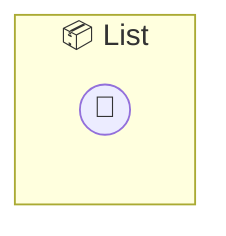

# List

List — Simple reactive list for testing state sync A minimal task list using @stateful with constructor-injected state. Perfect for testing end-to-end synchronization across clients.

> **0 tools** · API Photon · v1.0.0 · MIT

**Platform Features:** `stateful`

## ⚙️ Configuration


| Variable | Required | Type | Description |
|----------|----------|------|-------------|
| `LIST_ITEMS` | No | string[] | No description available |


## 🔧 Tools


No tools defined.


## 🏗️ Architecture




## 📥 Usage

```bash
# Install from marketplace
photon add list

# Get MCP config for your client
photon info list --mcp
```

## 📦 Dependencies

No external dependencies.

---

MIT · v1.0.0 · Test
