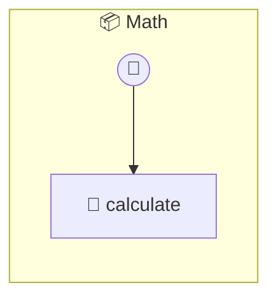

# Calculator

Math expression evaluator Evaluate math expressions with functions like sqrt, sin, cos, mean, median, etc.

> **1 tools** · API Photon · v1.1.0 · MIT


## ⚙️ Configuration

No configuration required.


## 🔧 Tools


### `calculate`

Calculate a math expression


| Parameter | Type | Required | Description |
|-----------|------|----------|-------------|
| `expression` | string | Yes | - (e.g. `sqrt(16) + pow(2, 3) - abs(-2)`) |


---


## 🏗️ Architecture




## 📥 Usage

```bash
# Install from marketplace
photon add math

# Get MCP config for your client
photon info math --mcp
```

## 📦 Dependencies

No external dependencies.

---

MIT · v1.1.0 · Portel
