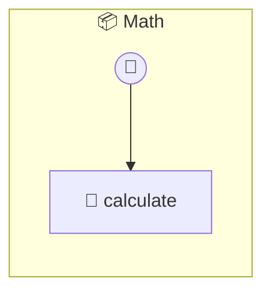

# Math Photon MCP

Advanced math expression evaluator

> **1 tools** · API Photon · v1.1.0 · MIT


## ⚙️ Configuration

No configuration required.


## 🔧 Tools


### `calculate`

Calculate a math expression string. Supports +, -, *, /, ^, parentheses, sqrt, log, sin, cos, tan, pow, min, max, sum, mean, median, std, abs, floor, ceil, round, random, PI, E. Example: { expression: "mean([1,2,3,4]) + max(5, 10) - abs(-7)" }


| Parameter | Type | Required | Description |
|-----------|------|----------|-------------|
| `expression` | string | Yes | The math expression to calculate |


---


## 🏗️ Architecture




## 📥 Usage

```bash
# Install from marketplace
photon add math

# Get MCP config for your client
photon info math --mcp
```

## 📦 Dependencies

No external dependencies.

---

MIT · v1.1.0 · Portel
