# Math Photon MCP

Advanced math expression evaluator

> **8 tools** · API Photon · v1.1.0 · MIT


## ⚙️ Configuration

No configuration required.


## 🔧 Tools


### `calculate`

Calculate a math expression string. Supports +, -, *, /, ^, parentheses, sqrt, log, sin, cos, tan, pow, min, max, sum, mean, median, std, abs, floor, ceil, round, random, PI, E. Example: { expression: "mean([1,2,3,4]) + max(5, 10) - abs(-7)" }


| Parameter | Type | Required | Description |
|-----------|------|----------|-------------|
| `expression` | any | Yes | The math expression to calculate |


---


### `testBasicArithmetic`

No description available


---


### `testSqrt`

No description available


---


### `testPower`

No description available


---


### `testAbs`

No description available


---


### `testMean`

No description available


---


### `testComplexExpression`

No description available


---


### `testExternalService`

No description available


---


## 🏗️ Architecture

```mermaid
flowchart LR
    subgraph math["📦 Math"]
        direction TB
        PHOTON((🎯))
        T0[🔧 calculate]
        PHOTON --> T0
        T1[✅ testBasicArithmetic]
        PHOTON --> T1
        T2[✅ testSqrt]
        PHOTON --> T2
        T3[✅ testPower]
        PHOTON --> T3
        T4[✅ testAbs]
        PHOTON --> T4
        T5[✅ testMean]
        PHOTON --> T5
        T6[✅ testComplexExpression]
        PHOTON --> T6
        T7[✅ testExternalService]
        PHOTON --> T7
    end
```




## 📥 Usage

```bash
# Install from marketplace
photon add math

# Get MCP config for your client
photon get math --mcp
```

## 📦 Dependencies

No external dependencies.

---

MIT · v1.1.0 · Portel
