# Mcp Orchestrator

MCP Orchestrator Photon

> **10 tools** · API Photon · v1.0.0 · MIT

**Platform Features:** `mcp-bridge`

## ⚙️ Configuration

No configuration required.


## 🔧 Tools


### `discoverMCPs`

List all available MCPs and their tools  Discovers which MCPs are configured and accessible, showing their available tools.


| Parameter | Type | Required | Description |
|-----------|------|----------|-------------|
| `mcpNames` | any | No | Comma-separated list of MCP names to check |


---


### `checkMCP`

Check if a specific MCP is available


| Parameter | Type | Required | Description |
|-----------|------|----------|-------------|
| `mcpName` | any | Yes | Name of the MCP to check |


---


### `callTool`

Call a tool on any MCP  Generic method to call any tool on any configured MCP. This demonstrates the polyglot nature - the MCP can be written in any language (Python, Rust, Go, etc.)


| Parameter | Type | Required | Description |
|-----------|------|----------|-------------|
| `mcpName` | any | Yes | Name of the MCP server |
| `toolName` | any | Yes | Name of the tool to call |
| `params` | any | Yes | JSON parameters for the tool |


---


### `researchWorkflow`

Research Workflow - Combine search and browser MCPs  Demonstrates orchestrating multiple MCPs: 1. Search for information using tavily (Node.js MCP) 2. Optionally fetch page content using browser MCP


| Parameter | Type | Required | Description |
|-----------|------|----------|-------------|
| `query` | any | Yes | Search query |
| `fetchContent` | any | Yes | Whether to fetch full page content for top result |
| `maxResults` | any | Yes | Maximum number of search results |


---


### `reasoningWorkflow`

Multi-Step Reasoning Workflow  Uses sequential-thinking MCP (if available) to break down a complex problem into steps, demonstrating how to use specialized reasoning MCPs.


| Parameter | Type | Required | Description |
|-----------|------|----------|-------------|
| `problem` | any | Yes | The problem to analyze |
| `steps` | any | Yes | Number of reasoning steps |


---


### `shellWorkflow`

Shell Command Workflow  Demonstrates using the Shell MCP to execute system commands. This MCP might be written in any language that can spawn processes.


| Parameter | Type | Required | Description |
|-----------|------|----------|-------------|
| `command` | any | Yes | Shell command to execute |
| `workingDir` | any | No | Working directory |


---


### `parallelExecution`

Parallel MCP Execution  Demonstrates calling multiple MCPs in parallel and combining results. Each MCP can be written in a different language.


| Parameter | Type | Required | Description |
|-----------|------|----------|-------------|
| `mcpCalls` | any | Yes | JSON array of MCP calls: [{mcp: "name", tool: "tool", params: {...}}] |


---


### `chainedWorkflow`

Chained MCP Workflow  Demonstrates chaining MCP calls where output from one becomes input to another. Perfect for pipelines that span multiple services/languages.


| Parameter | Type | Required | Description |
|-----------|------|----------|-------------|
| `steps` | any | Yes | JSON array of steps: [{mcp: "name", tool: "tool", params: {...}, outputKey: "key"}] |


---


### `inspectMCP`

Get detailed info about a specific MCP's tools


| Parameter | Type | Required | Description |
|-----------|------|----------|-------------|
| `mcpName` | any | Yes | Name of the MCP to inspect |


---


### `findToolsAcrossMCPs`

Find tools across multiple MCPs  Search for tools by keyword across all configured MCPs.


| Parameter | Type | Required | Description |
|-----------|------|----------|-------------|
| `query` | any | Yes | Search keyword |
| `mcpNames` | any | No | Comma-separated list of MCPs to search |


---


## 🏗️ Architecture

```mermaid
flowchart LR
    subgraph mcp_orchestrator["📦 Mcp Orchestrator"]
        direction TB
        PHOTON((🎯))
        T0[🔧 discoverMCPs]
        PHOTON --> T0
        T1[✅ checkMCP]
        PHOTON --> T1
        T2[🔧 callTool]
        PHOTON --> T2
        T3[🔧 researchWorkflow]
        PHOTON --> T3
        T4[🔧 reasoningWorkflow]
        PHOTON --> T4
        T5[🔧 shellWorkflow]
        PHOTON --> T5
        T6[🔧 parallelExecution]
        PHOTON --> T6
        T7[🔧 chainedWorkflow]
        PHOTON --> T7
        T8[🔧 inspectMCP]
        PHOTON --> T8
        T9[📖 findToolsAcrossMCPs]
        PHOTON --> T9
    end
```




## 📥 Usage

```bash
# Install from marketplace
photon add mcp-orchestrator

# Get MCP config for your client
photon get mcp-orchestrator --mcp
```

## 📦 Dependencies

No external dependencies.

---

MIT · v1.0.0 · Portel
