# MCP Orchestrator

Combine multiple MCPs into powerful workflows

> **10 tools** · API Photon · v1.0.0 · MIT

**Platform Features:** `mcp-bridge`

## ⚙️ Configuration

No configuration required.


## 🔧 Tools


### `discoverMCPs`

List all available MCPs and their tools


---


### `checkMCP`

Check if a specific MCP is available


---


### `callTool`

Call a tool on any MCP


---


### `researchWorkflow`

Research Workflow - Combine search and browser MCPs


---


### `reasoningWorkflow`

Multi-Step Reasoning Workflow using sequential-thinking MCP


---


### `shellWorkflow`

Shell Command Workflow - Execute system commands


---


### `parallelExecution`

Parallel MCP Execution - Call multiple MCPs concurrently


---


### `chainedWorkflow`

Chained MCP Workflow - Output from one MCP becomes input to another


---


### `inspectMCP`

Get detailed info about a specific MCP's tools


---


### `findToolsAcrossMCPs`

Find tools across multiple MCPs by keyword


---


## 🏗️ Architecture

```mermaid
flowchart LR
    subgraph mcp_orchestrator["📦 Mcp Orchestrator"]
        direction TB
        PHOTON((🎯))
        T0[🔧 discoverMCPs]
        PHOTON --> T0
        T1[✅ checkMCP]
        PHOTON --> T1
        T2[🔧 callTool]
        PHOTON --> T2
        T3[🔧 researchWorkflow]
        PHOTON --> T3
        T4[🔧 reasoningWorkflow]
        PHOTON --> T4
        T5[🔧 shellWorkflow]
        PHOTON --> T5
        T6[🔧 parallelExecution]
        PHOTON --> T6
        T7[🔧 chainedWorkflow]
        PHOTON --> T7
        T8[🔧 inspectMCP]
        PHOTON --> T8
        T9[📖 findToolsAcrossMCPs]
        PHOTON --> T9
    end
```




## 📥 Usage

```bash
# Install from marketplace
photon add mcp-orchestrator

# Get MCP config for your client
photon info mcp-orchestrator --mcp
```

## 📦 Dependencies

No external dependencies.

---

MIT · v1.0.0 · Portel
