# MCP Orchestrator

Combine multiple MCPs into powerful workflows

> **10 tools** · API Photon · v1.0.0 · MIT

**Platform Features:** `mcp-bridge`

## ⚙️ Configuration

No configuration required.


## 🔧 Tools


### `discover`

List all available MCPs and their tools


---


### `check`

Check if a specific MCP is available


---


### `call`

Call a tool on any MCP


---


### `research`

Research Workflow - Combine search and browser MCPs


---


### `reason`

Multi-Step Reasoning Workflow using sequential-thinking MCP


---


### `shell`

Shell Command Workflow - Execute system commands


---


### `parallel`

Parallel MCP Execution - Call multiple MCPs concurrently


---


### `chain`

Chained MCP Workflow - Output from one MCP becomes input to another


---


### `inspect`

Get detailed info about a specific MCP's tools


---


### `tools`

Find tools across multiple MCPs by keyword


---


## 🏗️ Architecture

```mermaid
flowchart LR
    subgraph mcp_orchestrator["📦 Mcp Orchestrator"]
        direction TB
        PHOTON((🎯))
        T0[🔧 discover]
        PHOTON --> T0
        T1[✅ check]
        PHOTON --> T1
        T2[🔧 call]
        PHOTON --> T2
        T3[🔧 research]
        PHOTON --> T3
        T4[🔧 reason]
        PHOTON --> T4
        T5[🔧 shell]
        PHOTON --> T5
        T6[🔧 parallel]
        PHOTON --> T6
        T7[🔧 chain]
        PHOTON --> T7
        T8[🔧 inspect]
        PHOTON --> T8
        T9[🔧 tools]
        PHOTON --> T9
    end
```




## 📥 Usage

```bash
# Install from marketplace
photon add mcp-orchestrator

# Get MCP config for your client
photon info mcp-orchestrator --mcp
```

## 📦 Dependencies

No external dependencies.

---

MIT · v1.0.0 · Portel
