# MongoDB

NoSQL database operations

> **18 tools** · API Photon · v1.0.0 · MIT


## ⚙️ Configuration


| Variable | Required | Type | Description |
|----------|----------|------|-------------|
| `MONGO_D_B_URI` | Yes | string | MongoDB connection URI (required) |
| `MONGO_D_B_DATABASE` | Yes | string | Default database name (required) |


### Setup Instructions

- uri: MongoDB connection URI (required)
- database: Default database name (required)


## 🔧 Tools


### `find`

Find documents in a collection


| Parameter | Type | Required | Description |
|-----------|------|----------|-------------|
| `collection` | any | Yes | Collection name [min: 1, max: 120] (e.g. `users`) |
| `filter` | any | Yes | Query filter (MongoDB query object) (e.g. `{"age":{"$gt":25}}`) |
| `limit` | any | No | Maximum number of documents to return [min: 1, max: 1000] |
| `sort` | any | Yes | Sort specification (e.g. `{"age":-1}`) |


---


### `findOne`

Find a single document


| Parameter | Type | Required | Description |
|-----------|------|----------|-------------|
| `collection` | any | Yes | Collection name [min: 1, max: 120] (e.g. `users`) |
| `filter` | any | Yes | Query filter (MongoDB query object) [min: 1] (e.g. `{"email":"user@example.com"}`) |


---


### `insertOne`

Insert a document


| Parameter | Type | Required | Description |
|-----------|------|----------|-------------|
| `collection` | any | Yes | Collection name [min: 1, max: 120] (e.g. `users`) |
| `document` | any | Yes | Document to insert [min: 1] (e.g. `{"name":"John","email":"john@example.com","age":30}`) |


---


### `insertMany`

Insert multiple documents


| Parameter | Type | Required | Description |
|-----------|------|----------|-------------|
| `collection` | any | Yes | Collection name [min: 1, max: 120] (e.g. `users`) |
| `documents` | any | Yes | Array of documents to insert [min: 1] (e.g. `[{"name":"John"},{"name":"Jane"}]`) |


---


### `updateOne`

Update a document


| Parameter | Type | Required | Description |
|-----------|------|----------|-------------|
| `collection` | any | Yes | Collection name [min: 1, max: 120] (e.g. `users`) |
| `filter` | any | Yes | Query filter to match documents [min: 1] (e.g. `{"email":"user@example.com"}`) |
| `update` | any | Yes | Update operations [min: 1] (e.g. `{"$set":{"name":"John"}}`) |
| `upsert` | any | No | Create document if it doesn't exist |


---


### `updateMany`

Update multiple documents


| Parameter | Type | Required | Description |
|-----------|------|----------|-------------|
| `collection` | any | Yes | Collection name [min: 1, max: 120] (e.g. `users`) |
| `filter` | any | Yes | Query filter to match documents [min: 1] (e.g. `{"age":{"$gt":25}}`) |
| `update` | any | Yes | Update operations [min: 1] (e.g. `{"$inc":{"loginCount":1}}`) |


---


### `removeOne`

Delete a document


| Parameter | Type | Required | Description |
|-----------|------|----------|-------------|
| `collection` | any | Yes | Collection name [min: 1, max: 120] (e.g. `users`) |
| `filter` | any | Yes | Query filter to match document [min: 1] (e.g. `{"email":"user@example.com"}`) |


---


### `removeMany`

Delete multiple documents


| Parameter | Type | Required | Description |
|-----------|------|----------|-------------|
| `collection` | any | Yes | Collection name [min: 1, max: 120] (e.g. `users`) |
| `filter` | any | Yes | Query filter to match documents [min: 1] (e.g. `{"status":"inactive"}`) |


---


### `aggregate`

Run aggregation pipeline


| Parameter | Type | Required | Description |
|-----------|------|----------|-------------|
| `collection` | any | Yes | Collection name [min: 1, max: 120] (e.g. `orders`) |
| `pipeline` | any | Yes | Aggregation pipeline array [min: 1] (e.g. `[{"$match":{"status":"completed"}},{"$group":{"_id":"$customerId","total":{"$sum":"$amount"}}}]`) |


---


### `count`

Count documents matching filter


| Parameter | Type | Required | Description |
|-----------|------|----------|-------------|
| `collection` | any | Yes | Collection name [min: 1, max: 120] (e.g. `users`) |
| `filter` | any | Yes | Query filter (optional, counts all if omitted) (e.g. `{"status":"active"}`) |


---


### `collections`

List all collections in database


---


### `index`

Create an index on a collection


| Parameter | Type | Required | Description |
|-----------|------|----------|-------------|
| `collection` | any | Yes | Collection name [min: 1, max: 120] (e.g. `users`) |
| `keys` | any | Yes | Index specification [min: 1] (e.g. `{"email":1}`) |
| `unique` | any | No | Create unique index |


---


### `distinct`

Get distinct values for a field


| Parameter | Type | Required | Description |
|-----------|------|----------|-------------|
| `collection` | any | Yes | Collection name [min: 1, max: 120] (e.g. `users`) |
| `field` | any | Yes | Field name to get distinct values from [min: 1, max: 200] (e.g. `country`) |
| `filter` | any | Yes | Optional query filter (e.g. `{"status":"active"}`) |


---


### `testAfterAll`

No description available


---


### `testCollections`

No description available


---


### `testInsertFind`

No description available


---


### `testCount`

No description available


---


### `testDelete`

No description available


---


## 🏗️ Architecture

```mermaid
flowchart LR
    subgraph mongodb["📦 Mongodb"]
        direction TB
        PHOTON((🎯))
        T0[📖 find]
        PHOTON --> T0
        T1[📖 findOne]
        PHOTON --> T1
        T2[✏️ insertOne]
        PHOTON --> T2
        T3[✏️ insertMany]
        PHOTON --> T3
        T4[🔄 updateOne]
        PHOTON --> T4
        T5[🔄 updateMany]
        PHOTON --> T5
        T6[🗑️ removeOne]
        PHOTON --> T6
        T7[🗑️ removeMany]
        PHOTON --> T7
        T8[🔧 aggregate]
        PHOTON --> T8
        T9[🔧 count]
        PHOTON --> T9
        T10[🔧 collections]
        PHOTON --> T10
        T11[🔧 index]
        PHOTON --> T11
        T12[🔧 distinct]
        PHOTON --> T12
        T13[✅ testAfterAll]
        PHOTON --> T13
        T14[✅ testCollections]
        PHOTON --> T14
        T15[✅ testInsertFind]
        PHOTON --> T15
        T16[✅ testCount]
        PHOTON --> T16
        T17[✅ testDelete]
        PHOTON --> T17
    end

    subgraph deps["Dependencies"]
        direction TB
        NPM0[📚 mongodb]
    end
```




## 📥 Usage

```bash
# Install from marketplace
photon add mongodb

# Get MCP config for your client
photon get mongodb --mcp
```

## 📦 Dependencies


```
mongodb@^6.3.0
```

---

MIT · v1.0.0 · Portel
