# MongoDB

Flexible document-oriented database

> **14 tools** · API Photon · v1.0.0 · MIT


## ⚙️ Configuration


| Variable | Required | Type | Description |
|----------|----------|------|-------------|
| `MONGO_D_B_URI` | Yes | string | No description available |
| `MONGO_D_B_DATABASE` | Yes | string | No description available |


## 📋 Quick Reference

| Method | Description |
|--------|-------------|
| `find` | Find documents in a collection |
| `get` | Find a single document |
| `insert` | Insert a document |
| `bulk` | Insert multiple documents |
| `replace` | Update a document |
| `update` | Update multiple documents |
| `remove` | Delete a document |
| `delete` | Delete multiple documents |
| `aggregate` | Run aggregation pipeline |
| `count` | Count documents matching filter |
| `collections` | List all collections in database |
| `index` | Create an index on a collection |
| `distinct` | Get distinct values for a field |
| `drop` | Drop a collection |


## 🔧 Tools


### `find`

Find documents in a collection


| Parameter | Type | Required | Description |
|-----------|------|----------|-------------|
| `collection` | string | Yes | Collection name [min: 1, max: 120] (e.g. `users`) |
| `filter` | object | No | Query filter (MongoDB query object) |
| `limit` | number | No | Max documents to return [min: 1, max: 1000] |
| `sort` | object | No | Sort specification |


---


### `get`

Find a single document


| Parameter | Type | Required | Description |
|-----------|------|----------|-------------|
| `collection` | string | Yes | Collection name [min: 1, max: 120] (e.g. `users`) |
| `filter` | object | Yes | Query filter (MongoDB query object) |


---


### `insert`

Insert a document


| Parameter | Type | Required | Description |
|-----------|------|----------|-------------|
| `collection` | string | Yes | Collection name [min: 1, max: 120] (e.g. `users`) |
| `document` | object | Yes | Document to insert |


---


### `bulk`

Insert multiple documents


| Parameter | Type | Required | Description |
|-----------|------|----------|-------------|
| `collection` | string | Yes | Collection name [min: 1, max: 120] (e.g. `users`) |
| `documents` | object[] | Yes | Array of documents to insert |


---


### `replace`

Update a document


| Parameter | Type | Required | Description |
|-----------|------|----------|-------------|
| `collection` | string | Yes | Collection name [min: 1, max: 120] (e.g. `users`) |
| `filter` | object | Yes | Query filter to match documents |
| `update` | object | Yes | Update operations (e.g., {"$set":{"name":"John"}}) |
| `upsert` | boolean | No | Create document if it doesn't exist |


---


### `update`

Update multiple documents


| Parameter | Type | Required | Description |
|-----------|------|----------|-------------|
| `collection` | string | Yes | Collection name [min: 1, max: 120] (e.g. `users`) |
| `filter` | object | Yes | Query filter to match documents |
| `update` | object | Yes | Update operations |


---


### `remove`

Delete a document


| Parameter | Type | Required | Description |
|-----------|------|----------|-------------|
| `collection` | string | Yes | Collection name [min: 1, max: 120] (e.g. `users`) |
| `filter` | object | Yes | Query filter to match document |


---


### `delete`

Delete multiple documents


| Parameter | Type | Required | Description |
|-----------|------|----------|-------------|
| `collection` | string | Yes | Collection name [min: 1, max: 120] (e.g. `users`) |
| `filter` | object | Yes | Query filter to match documents |


---


### `aggregate`

Run aggregation pipeline


| Parameter | Type | Required | Description |
|-----------|------|----------|-------------|
| `collection` | string | Yes | Collection name [min: 1, max: 120] (e.g. `orders`) |
| `pipeline` | object[] | Yes | Aggregation pipeline array |


---


### `count`

Count documents matching filter


| Parameter | Type | Required | Description |
|-----------|------|----------|-------------|
| `collection` | string | Yes | Collection name [min: 1, max: 120] (e.g. `users`) |
| `filter` | object | No | Query filter (counts all if omitted) |


---


### `collections`

List all collections in database


---


### `index`

Create an index on a collection


| Parameter | Type | Required | Description |
|-----------|------|----------|-------------|
| `collection` | string | Yes | Collection name [min: 1, max: 120] (e.g. `users`) |
| `keys` | object | Yes | Index specification (e.g., {"email":1}) |
| `unique` | boolean | No | Create unique index |


---


### `distinct`

Get distinct values for a field


| Parameter | Type | Required | Description |
|-----------|------|----------|-------------|
| `collection` | string | Yes | Collection name [min: 1, max: 120] (e.g. `users`) |
| `field` | string | Yes | Field name [min: 1, max: 200] (e.g. `country`) |
| `filter` | object | No | Optional query filter |


---


### `drop`

Drop a collection


| Parameter | Type | Required | Description |
|-----------|------|----------|-------------|
| `collection` | string | Yes | Collection name [min: 1, max: 120] (e.g. `users`) |


---


## 🏗️ Architecture

```mermaid
flowchart LR
    subgraph mongodb["📦 Mongodb"]
        direction TB
        PHOTON((🎯))
        T0[📖 find]
        PHOTON --> T0
        T1[📖 get]
        PHOTON --> T1
        T2[✏️ insert]
        PHOTON --> T2
        T3[🔧 bulk]
        PHOTON --> T3
        T4[🔧 replace]
        PHOTON --> T4
        T5[🔄 update]
        PHOTON --> T5
        T6[🗑️ remove]
        PHOTON --> T6
        T7[🗑️ delete]
        PHOTON --> T7
        T8[🔧 aggregate]
        PHOTON --> T8
        T9[🔧 count]
        PHOTON --> T9
        T10[🔧 collections]
        PHOTON --> T10
        T11[🔧 index]
        PHOTON --> T11
        T12[🔧 distinct]
        PHOTON --> T12
        T13[🗑️ drop]
        PHOTON --> T13
    end

    subgraph deps["Dependencies"]
        direction TB
        NPM0[📚 mongodb]
    end
```




## 📥 Usage

```bash
# Install from marketplace
photon add mongodb

# Get MCP config for your client
photon info mongodb --mcp
```

## 📦 Dependencies


```
mongodb@^6.3.0
```

---

MIT · v1.0.0 · Portel
