# PostgreSQL

Database operations for PostgreSQL Provides tools to query, insert, update, and manage PostgreSQL databases. Supports parameterized queries, transactions, and schema introspection. Common use cases: - Data analysis: "Query user statistics from the database" - Data management: "Insert a new user record" - Schema exploration: "List all tables in the database" Example: query({ sql: "SELECT * FROM users WHERE active = $1", params: [true] }) Configuration: - host: Database host (default: localhost) - port: Database port (default: 5432) - database: Database name (required) - user: Database user (required) - password: Database password (required) - ssl: Enable SSL connection (default: false) Dependencies are auto-installed on first run.

> **7 tools** · API Photon · v1.1.0 · MIT


## ⚙️ Configuration


| Variable | Required | Type | Description |
|----------|----------|------|-------------|
| `POSTGRE_S_Q_L_DATABASE` | Yes | string | Database name (required) |
| `POSTGRE_S_Q_L_USER` | Yes | string | Database user (required) |
| `POSTGRE_S_Q_L_PASSWORD` | Yes | string | Database password (required) |
| `POSTGRE_S_Q_L_HOST` | No | string | Database host (default: localhost) (default: `localhost`) |
| `POSTGRE_S_Q_L_PORT` | No | number | Database port (default: 5432) (default: `5432`) |
| `POSTGRE_S_Q_L_SSL` | No | boolean | Enable SSL connection (default: false) |


### Setup Instructions

- host: Database host (default: localhost)
- port: Database port (default: 5432)
- database: Database name (required)
- user: Database user (required)
- password: Database password (required)
- ssl: Enable SSL connection (default: false)
Dependencies are auto-installed on first run.


## 🔧 Tools


### `query`

Execute a SQL query


| Parameter | Type | Required | Description |
|-----------|------|----------|-------------|
| `sql` | string | Yes | SQL query to execute (supports $1, $2, etc. for parameters) |
| `params` | any[] | No | Query parameters array |


---


### `transaction`

Execute multiple SQL statements in a transaction


| Parameter | Type | Required | Description |
|-----------|------|----------|-------------|
| `statements` | Array<{ sql: string | Yes | Array of SQL statements with optional parameters |


---


### `tables`

List all tables in the database


| Parameter | Type | Required | Description |
|-----------|------|----------|-------------|
| `schema` | any | No | Schema name |


---


### `describe`

Get table schema information


| Parameter | Type | Required | Description |
|-----------|------|----------|-------------|
| `table` | string | Yes | Table name |
| `schema` | string | No | Schema name |


---


### `indexes`

List all indexes on a table


| Parameter | Type | Required | Description |
|-----------|------|----------|-------------|
| `table` | string | Yes | Table name |
| `schema` | string | No | Schema name |


---


### `insert`

Execute a SQL INSERT statement


| Parameter | Type | Required | Description |
|-----------|------|----------|-------------|
| `table` | string | Yes | Table name |
| `data` | Record<string | Yes | Object with column names as keys |
| `returning` | string[] | No | Column names to return |


---


### `stats`

Get database statistics


---


## 🏗️ Architecture

```mermaid
flowchart LR
    subgraph postgres["📦 Postgres"]
        direction TB
        PHOTON((🎯))
        T0[📖 query]
        PHOTON --> T0
        T1[🔧 transaction]
        PHOTON --> T1
        T2[🔧 tables]
        PHOTON --> T2
        T3[🔧 describe]
        PHOTON --> T3
        T4[🔧 indexes]
        PHOTON --> T4
        T5[✏️ insert]
        PHOTON --> T5
        T6[🔧 stats]
        PHOTON --> T6
    end

    subgraph deps["Dependencies"]
        direction TB
        NPM0[📚 pg]
    end
```




## 📥 Usage

```bash
# Install from marketplace
photon add postgres

# Get MCP config for your client
photon info postgres --mcp
```

## 📦 Dependencies


```
pg@^8.11.0
```

---

MIT · v1.1.0 · Portel
