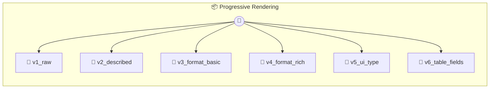

# Progressive Rendering

Same Data, Better Display

> **6 tools** · API Photon · v1.0.0 · MIT


## ⚙️ Configuration

No configuration required.


## 🔧 Tools


### `v1_raw`

Level 1: Raw return — auto-UI guesses the layout


---


### `v2_described`

Level 2: Rich description — method card gets context, rendering still auto-detected. Team members with roles and availability status. Returns the full engineering team roster.


---


### `v3_format_basic`

Level 3: Format hint — Beam renders as a table instead of guessing


---


### `v4_format_rich`

Level 4: Rich format — field mappings produce a polished list with avatars and badges


---


### `v5_ui_type`

Level 5: UI type class — programmatic control over card layout


---


### `v6_table_fields`

Level 6: Table with typed Fields — maximum control over columns and formatting


---


## 🏗️ Architecture




## 📥 Usage

```bash
# Install from marketplace
photon add progressive-rendering

# Get MCP config for your client
photon info progressive-rendering --mcp
```

## 📦 Dependencies

No external dependencies.

---

MIT · v1.0.0 · Portel
