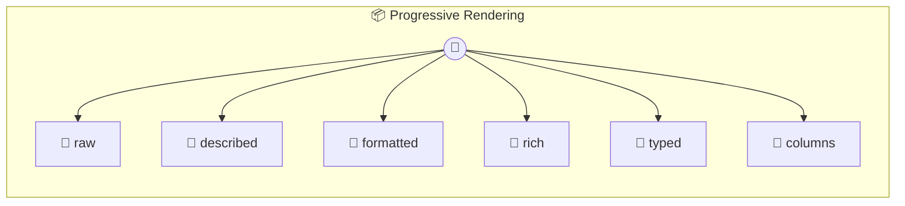

# Progressive Rendering

Same Data, Better Display Six methods return the same team data, each progressively enhanced.

> **6 tools** · API Photon · v1.0.0 · MIT


## ⚙️ Configuration

No configuration required.


## 📋 Quick Reference

| Method | Description |
|--------|-------------|
| `raw` | Level 1: Raw return — auto-UI guesses the layout |
| `described` | Level 2: Rich description — method card gets context, rendering still auto-detected. |
| `formatted` | Level 3: Format hint — Beam renders as a table instead of guessing |
| `rich` | Level 4: Rich format — field mappings produce a polished list with avatars and badges |
| `typed` | Level 5: UI type class — programmatic control over card layout |
| `columns` | Level 6: Table with typed fields — maximum control over columns and formatting |


## 🔧 Tools


### `raw`

Level 1: Raw return — auto-UI guesses the layout


---


### `described`

Level 2: Rich description — method card gets context, rendering still auto-detected. Team members with roles and availability status. Returns the full engineering team roster.


---


### `formatted`

Level 3: Format hint — Beam renders as a table instead of guessing


---


### `rich`

Level 4: Rich format — field mappings produce a polished list with avatars and badges


---


### `typed`

Level 5: UI type class — programmatic control over card layout


---


### `columns`

Level 6: Table with typed fields — maximum control over columns and formatting


---


## 🏗️ Architecture


```mermaid
flowchart LR
    subgraph progressive_rendering["📦 Progressive Rendering"]
        direction TB
        PHOTON((🎯))
        T0[🔧 raw]
        PHOTON --> T0
        T1[🔧 described]
        PHOTON --> T1
        T2[🔧 formatted]
        PHOTON --> T2
        T3[🔧 rich]
        PHOTON --> T3
        T4[🔧 typed]
        PHOTON --> T4
        T5[🔧 columns]
        PHOTON --> T5
    end
```


## 📥 Usage

```bash
# Install from marketplace
photon add progressive-rendering

# Get MCP config for your client
photon info progressive-rendering --mcp
```

## 📦 Dependencies

No external dependencies.

---

MIT · v1.0.0 · Portel
