# Redis

In-memory data store and cache

> **23 tools** · API Photon · v1.0.0 · MIT


## ⚙️ Configuration


| Variable | Required | Type | Description |
|----------|----------|------|-------------|
| `REDIS_URL` | No | string | Redis connection URL (default: redis://localhost:6379) (default: `redis://localhost:6379`) |
| `REDIS_PASSWORD` | No | string | Redis password (optional) |
| `REDIS_DATABASE` | No | number | Database number (default: 0) |


### Setup Instructions

- url: Redis connection URL (default: redis://localhost:6379)
- password: Redis password (optional)
- database: Database number (default: 0)


## 🔧 Tools


### `get`

Get value by key


| Parameter | Type | Required | Description |
|-----------|------|----------|-------------|
| `key` | any | Yes | Key name [min: 1, max: 512] (e.g. `user:123:session`) |


---


### `set`

Set key-value pair


| Parameter | Type | Required | Description |
|-----------|------|----------|-------------|
| `key` | any | Yes | Key name [min: 1, max: 512] (e.g. `user:123:name`) |
| `value` | any | Yes | Value to store [min: 1] (e.g. `John`) |
| `ttl` | any | Yes | Time to live in seconds (optional, max 30 days) [min: 1, max: 2592000] (e.g. `3600`) |


---


### `del`

Delete one or more keys


| Parameter | Type | Required | Description |
|-----------|------|----------|-------------|
| `keys` | any | Yes | Key name(s) to delete (string or array) [min: 1] (e.g. `["user:123","user:124"]`) |


---


### `exists`

Check if key exists


| Parameter | Type | Required | Description |
|-----------|------|----------|-------------|
| `key` | any | Yes | Key name [min: 1, max: 512] (e.g. `user:123`) |


---


### `keys`

Get all keys matching pattern


| Parameter | Type | Required | Description |
|-----------|------|----------|-------------|
| `pattern` | any | Yes | Key pattern [min: 1, max: 200] (e.g. `user:*`) |


---


### `incr`

Increment numeric value


| Parameter | Type | Required | Description |
|-----------|------|----------|-------------|
| `key` | any | Yes | Key name [min: 1, max: 512] (e.g. `counter:page_views`) |
| `amount` | any | No | Amount to increment by [min: 1] (e.g. `5`) |


---


### `decr`

Decrement numeric value


| Parameter | Type | Required | Description |
|-----------|------|----------|-------------|
| `key` | any | Yes | Key name [min: 1, max: 512] (e.g. `counter:stock`) |
| `amount` | any | No | Amount to decrement by [min: 1] (e.g. `3`) |


---


### `expire`

Set expiration time on key


| Parameter | Type | Required | Description |
|-----------|------|----------|-------------|
| `key` | any | Yes | Key name [min: 1, max: 512] (e.g. `session:123`) |
| `seconds` | any | Yes | Seconds until expiration (max 30 days) [min: 1, max: 2592000] (e.g. `3600`) |


---


### `ttl`

Get time to live for key


| Parameter | Type | Required | Description |
|-----------|------|----------|-------------|
| `key` | any | Yes | Key name [min: 1, max: 512] (e.g. `session:123`) |


---


### `lpush`

Push value to list (left side)


| Parameter | Type | Required | Description |
|-----------|------|----------|-------------|
| `key` | any | Yes | List key name [min: 1, max: 512] (e.g. `queue:jobs`) |
| `values` | any | Yes | Array of values to push [min: 1] (e.g. `["job1","job2"]`) |


---


### `rpush`

Push value to list (right side)


| Parameter | Type | Required | Description |
|-----------|------|----------|-------------|
| `key` | any | Yes | List key name [min: 1, max: 512] (e.g. `queue:jobs`) |
| `values` | any | Yes | Array of values to push [min: 1] (e.g. `["job1","job2"]`) |


---


### `lpop`

Pop value from list (left side)


| Parameter | Type | Required | Description |
|-----------|------|----------|-------------|
| `key` | any | Yes | List key name [min: 1, max: 512] (e.g. `queue:jobs`) |


---


### `rpop`

Pop value from list (right side)


| Parameter | Type | Required | Description |
|-----------|------|----------|-------------|
| `key` | any | Yes | List key name [min: 1, max: 512] (e.g. `queue:jobs`) |


---


### `llen`

Get list length


| Parameter | Type | Required | Description |
|-----------|------|----------|-------------|
| `key` | any | Yes | List key name [min: 1, max: 512] (e.g. `queue:jobs`) |


---


### `hget`

Get hash field value


| Parameter | Type | Required | Description |
|-----------|------|----------|-------------|
| `key` | any | Yes | Hash key name [min: 1, max: 512] (e.g. `user:123`) |
| `field` | any | Yes | Field name [min: 1, max: 200] (e.g. `name`) |


---


### `hset`

Set hash field value


| Parameter | Type | Required | Description |
|-----------|------|----------|-------------|
| `key` | any | Yes | Hash key name [min: 1, max: 512] (e.g. `user:123`) |
| `field` | any | Yes | Field name [min: 1, max: 200] (e.g. `name`) |
| `value` | any | Yes | Value to set [min: 1] (e.g. `John`) |


---


### `hgetall`

Get all fields and values in hash


| Parameter | Type | Required | Description |
|-----------|------|----------|-------------|
| `key` | any | Yes | Hash key name [min: 1, max: 512] (e.g. `user:123`) |


---


### `flush`

Flush all data from current database


---


### `testAfterAll`

No description available


---


### `testSetGet`

No description available


---


### `testDel`

No description available


---


### `testExists`

No description available


---


### `testSetWithTtl`

No description available


---


## 🏗️ Architecture

```mermaid
flowchart LR
    subgraph redis["📦 Redis"]
        direction TB
        PHOTON((🎯))
        T0[📖 get]
        PHOTON --> T0
        T1[✏️ set]
        PHOTON --> T1
        T2[🔧 del]
        PHOTON --> T2
        T3[🔧 exists]
        PHOTON --> T3
        T4[🔧 keys]
        PHOTON --> T4
        T5[🔧 incr]
        PHOTON --> T5
        T6[🔧 decr]
        PHOTON --> T6
        T7[🔧 expire]
        PHOTON --> T7
        T8[🔧 ttl]
        PHOTON --> T8
        T9[🔧 lpush]
        PHOTON --> T9
        T10[🔧 rpush]
        PHOTON --> T10
        T11[🔧 lpop]
        PHOTON --> T11
        T12[🔧 rpop]
        PHOTON --> T12
        T13[🔧 llen]
        PHOTON --> T13
        T14[🔧 hget]
        PHOTON --> T14
        T15[🔧 hset]
        PHOTON --> T15
        T16[🔧 hgetall]
        PHOTON --> T16
        T17[🔧 flush]
        PHOTON --> T17
        T18[✅ testAfterAll]
        PHOTON --> T18
        T19[✅ testSetGet]
        PHOTON --> T19
        T20[✅ testDel]
        PHOTON --> T20
        T21[✅ testExists]
        PHOTON --> T21
        T22[✅ testSetWithTtl]
        PHOTON --> T22
    end

    subgraph deps["Dependencies"]
        direction TB
        NPM0[📚 redis]
    end
```




## 📥 Usage

```bash
# Install from marketplace
photon add redis

# Get MCP config for your client
photon get redis --mcp
```

## 📦 Dependencies


```
redis@^4.6.0
```

---

MIT · v1.0.0 · Portel
