# Truth Serum

Forces unfiltered honesty, no hedging or diplomacy @description Powerful prompt serums that force specific cognitive behaviors @icon 💉 /
export default class Serum {
  /

> **10 tools** · API Photon · v1.6.1 · MIT


## ⚙️ Configuration

No configuration required.


## 🔧 Tools


### `truth`

Truth Serum - Forces unfiltered honesty, no hedging or diplomacy


---


### `clarity`

Clarity Serum - Cuts through complexity, forces simple explanations


---


### `challenger`

Challenger Serum - Injects healthy skepticism, stress-tests ideas


---


### `focus`

Focus Serum - Eliminates noise, surfaces what actually matters


---


### `perspective`

Perspective Serum - Forces genuine multi-stakeholder viewpoint


---


### `creative`

Creative Serum - Unlocks non-obvious solutions and connections


---


### `action`

Action Serum - Converts thinking into specific next steps


---


### `simplify`

Simplify Serum - Reduces complexity ruthlessly


---


### `empathy`

Empathy Serum - Forces genuine understanding of others


---


### `custom`

Custom Serum - Create your own behavioral injection


---


## 🏗️ Architecture

```mermaid
flowchart LR
    subgraph serum["📦 Serum"]
        direction TB
        PHOTON((🎯))
        T0[🔧 truth]
        PHOTON --> T0
        T1[🔧 clarity]
        PHOTON --> T1
        T2[🔧 challenger]
        PHOTON --> T2
        T3[🔧 focus]
        PHOTON --> T3
        T4[🔧 perspective]
        PHOTON --> T4
        T5[🔧 creative]
        PHOTON --> T5
        T6[🔧 action]
        PHOTON --> T6
        T7[🔧 simplify]
        PHOTON --> T7
        T8[🔧 empathy]
        PHOTON --> T8
        T9[🔧 custom]
        PHOTON --> T9
    end
```




## 📥 Usage

```bash
# Install from marketplace
photon add serum

# Get MCP config for your client
photon info serum --mcp
```

## 📦 Dependencies

No external dependencies.

---

MIT · v1.6.1
