# Slack

Send and manage messages

> **7 tools** · API Photon · v1.0.0 · MIT


## ⚙️ Configuration


| Variable | Required | Type | Description |
|----------|----------|------|-------------|
| `SLACK_PHOTON_TOKEN` | Yes | string | No description available |


## 📋 Quick Reference

| Method | Description |
|--------|-------------|
| `post` | Post a message |
| `channels` | List channels |
| `channel` | Get channel info |
| `history` | Get message history |
| `react` | Add reaction to message |
| `upload` | Upload file |
| `search` | Search messages |


## 🔧 Tools


### `post`

Post a message


| Parameter | Type | Required | Description |
|-----------|------|----------|-------------|
| `channel` | string | Yes | Channel name or ID |
| `text` | string | Yes | Message text [field: textarea] |
| `thread_ts` | string | No | Thread timestamp |
| `blocks` | string | No | Rich blocks (JSON string, optional) |


---


### `channels`

List channels


| Parameter | Type | Required | Description |
|-----------|------|----------|-------------|
| `types` | any | Yes | Channel types {@default public_channel} [choice: public_channel,private_channel] |
| `limit` | number } | No | Results limit [min: 1, max: 1000] |


---


### `channel`

Get channel info


| Parameter | Type | Required | Description |
|-----------|------|----------|-------------|
| `channel` | string | Yes | Channel name or ID |


---


### `history`

Get message history


| Parameter | Type | Required | Description |
|-----------|------|----------|-------------|
| `channel` | string | Yes | Channel name or ID |
| `limit` | number | No | Results [min: 1, max: 100] |
| `oldest` | string | No | Start timestamp |
| `latest` | string | No | End timestamp |


---


### `react`

Add reaction to message


| Parameter | Type | Required | Description |
|-----------|------|----------|-------------|
| `channel` | string | Yes | Channel name or ID |
| `timestamp` | string | Yes | Message timestamp |
| `name` | string | Yes | Emoji name (without colons) |


---


### `upload`

Upload file


| Parameter | Type | Required | Description |
|-----------|------|----------|-------------|
| `channel` | string | Yes | Channel name or ID |
| `content` | string | Yes | File content |
| `filename` | string | Yes | File name |
| `title` | string | No | File title |
| `comment` | string | No | Comment |


---


### `search`

Search messages


| Parameter | Type | Required | Description |
|-----------|------|----------|-------------|
| `query` | string | Yes | Search query |
| `count` | number | No | Results [min: 1, max: 100] |
| `sort` | 'score' | 'timestamp' | No | Sort order {@default score} [choice: score,timestamp] |


---


## 🏗️ Architecture

```mermaid
flowchart LR
    subgraph slack["📦 Slack"]
        direction TB
        PHOTON((🎯))
        T0[📤 post]
        PHOTON --> T0
        T1[🔧 channels]
        PHOTON --> T1
        T2[🔧 channel]
        PHOTON --> T2
        T3[🔧 history]
        PHOTON --> T3
        T4[🔧 react]
        PHOTON --> T4
        T5[📤 upload]
        PHOTON --> T5
        T6[📖 search]
        PHOTON --> T6
    end
```




## 📥 Usage

```bash
# Install from marketplace
photon add slack

# Get MCP config for your client
photon info slack --mcp
```

## 📦 Dependencies


```
@slack/web-api@^7.0.0
```

---

MIT · v1.0.0 · Portel
