# Slack

Send messages and manage Slack workspace Provides tools to send messages, list channels, and interact with Slack workspace. Requires a Slack Bot Token with appropriate scopes. Common use cases: - Notifications: "Send a deployment notification to #engineering" - Team updates: "Post the daily standup summary to #team" - Channel management: "List all public channels" Example: postMessage({ channel: "#general", text: "Hello team!" }) Configuration: - token: Slack Bot Token (required, starts with xoxb-) Dependencies are auto-installed on first run.

> **7 tools** · API Photon · v1.0.0 · MIT


## ⚙️ Configuration


| Variable | Required | Type | Description |
|----------|----------|------|-------------|
| `SLACK_TOKEN` | Yes | string | Slack Bot Token (required, starts with xoxb-) |


### Setup Instructions

- token: Slack Bot Token (required, starts with xoxb-)
Dependencies are auto-installed on first run.


## 🔧 Tools


### `post`

Post a message to a channel or user


| Parameter | Type | Required | Description |
|-----------|------|----------|-------------|
| `channel` | string | Yes | Channel name or ID [min: 1] (e.g. `#general`) |
| `text` | string | Yes | Message text [min: 1] (e.g. `Hello team!`) |
| `thread_ts` | string | No | Thread timestamp to reply to |
| `blocks` | string | No | Rich message blocks (optional, JSON string) |


---


### `channels`

List all channels in the workspace


| Parameter | Type | Required | Description |
|-----------|------|----------|-------------|
| `types` | any | Yes | Channel types (e.g. `public_channel`) |
| `limit` | number | No | Maximum number of channels to return [min: 1, max: 1000] |


---


### `channel`

Get channel information


| Parameter | Type | Required | Description |
|-----------|------|----------|-------------|
| `channel` | string | Yes | Channel name or ID [min: 1] (e.g. `#general`) |


---


### `history`

Get conversation history from a channel


| Parameter | Type | Required | Description |
|-----------|------|----------|-------------|
| `channel` | string | Yes | Channel name or ID [min: 1] (e.g. `#general`) |
| `limit` | number | No | Number of messages to retrieve [min: 1, max: 100] |
| `oldest` | string | No | Start of time range (Unix timestamp) |
| `latest` | string | No | End of time range (Unix timestamp) |


---


### `react`

Add a reaction to a message


| Parameter | Type | Required | Description |
|-----------|------|----------|-------------|
| `channel` | string | Yes | Channel name or ID [min: 1] (e.g. `#general`) |
| `timestamp` | string | Yes | Message timestamp [min: 1] |
| `name` | string | Yes | Reaction emoji name (without colons) [min: 1] (e.g. `thumbsup`) |


---


### `upload`

Upload a file to a channel


| Parameter | Type | Required | Description |
|-----------|------|----------|-------------|
| `channel` | string | Yes | Channel name or ID [min: 1] (e.g. `#general`) |
| `content` | string | Yes | File content (text) [min: 1] |
| `filename` | string | Yes | Filename [min: 1] (e.g. `report.txt`) |
| `title` | string | No | File title |
| `initial_comment` | string | No | Comment to add with the file |


---


### `search`

Search for messages in the workspace


| Parameter | Type | Required | Description |
|-----------|------|----------|-------------|
| `query` | string | Yes | Search query [min: 1] (e.g. `deployment`) |
| `count` | number | No | Number of results to return [min: 1, max: 100] |
| `sort` | 'score' | 'timestamp' | No | Sort order (e.g. `score`) |


---


## 🏗️ Architecture

```mermaid
flowchart LR
    subgraph slack["📦 Slack"]
        direction TB
        PHOTON((🎯))
        T0[📤 post]
        PHOTON --> T0
        T1[🔧 channels]
        PHOTON --> T1
        T2[🔧 channel]
        PHOTON --> T2
        T3[🔧 history]
        PHOTON --> T3
        T4[🔧 react]
        PHOTON --> T4
        T5[📤 upload]
        PHOTON --> T5
        T6[📖 search]
        PHOTON --> T6
    end
```




## 📥 Usage

```bash
# Install from marketplace
photon add slack

# Get MCP config for your client
photon info slack --mcp
```

## 📦 Dependencies


```
@slack/web-api@^7.0.0
```

---

MIT · v1.0.0 · Portel
