# Spreadsheet

Spreadsheet — CSV-backed spreadsheet with formulas A spreadsheet engine that works on plain CSV files. Formulas (=SUM, =AVG, etc.) are stored directly in CSV cells and evaluated at runtime. Named instances map to CSV files: `_use('budget')` → `budget.csv` in your spreadsheets folder. Pass a full path to open any CSV: `_use('/path/to/data.csv')`.

> **17 tools** · API Photon · v1.0.0 · MIT

**Platform Features:** `custom-ui` `stateful`

## ⚙️ Configuration

No configuration required.


## 📋 Quick Reference

| Method | Description |
|--------|-------------|
| `main` | Open spreadsheet UI |
| `view` | View the spreadsheet grid. |
| `get` | Get a cell value. |
| `set` | Set a cell value or formula. |
| `add` | Add a row of data. |
| `remove` | Remove a row |
| `update` | Update fields in a row |
| `query` | Query rows by condition. |
| `sort` | Sort by column. |
| `fill` | Fill a range with values or a pattern |
| `schema` | Show column headers and detected types |
| `resize` | Resize the spreadsheet grid |
| `ingest` | Import CSV data. |
| `dump` | Export as CSV. |
| `clear` | Clear cells. |
| `rename` | Rename a column header |
| `format` | Set column formatting. |


## 🔧 Tools


### `main`

Open spreadsheet UI


---


### `view`

View the spreadsheet grid. Returns the full spreadsheet or a specific range as a formatted table.


| Parameter | Type | Required | Description |
|-----------|------|----------|-------------|
| `range` | any | Yes | Optional cell range to view (e.g., "A1:D10") |


---


### `get`

Get a cell value. Returns the evaluated value and raw content (formula if any) for a single cell.


| Parameter | Type | Required | Description |
|-----------|------|----------|-------------|
| `cell` | string | Yes | Cell reference in A1 notation (e.g., "B3") |


---


### `set`

Set a cell value or formula. Set a cell to a plain value or a formula starting with "=". Formulas support: SUM, AVG, MAX, MIN, COUNT, IF, LEN, ABS, ROUND, CONCAT. Cell references use A1 notation. Ranges use A1:B2 notation.


| Parameter | Type | Required | Description |
|-----------|------|----------|-------------|
| `cell` | string | Yes | Cell reference in A1 notation (e.g., "B3") |
| `value` | string | Yes | Value or formula (e.g., "42" or "=SUM(A1:A5)") |


---


### `add`

Add a row of data. Add a new row to the bottom of the spreadsheet. Pass column values by header name.


| Parameter | Type | Required | Description |
|-----------|------|----------|-------------|
| `values` | Record<string | Yes | Key-value pairs mapping column names to values (e.g., {"Name": "Alice", "Age": "30"}) |


---


### `remove`

Remove a row


| Parameter | Type | Required | Description |
|-----------|------|----------|-------------|
| `row` | number | Yes | Row number to remove (1-indexed) |


---


### `update`

Update fields in a row


| Parameter | Type | Required | Description |
|-----------|------|----------|-------------|
| `row` | number | Yes | Row number to update (1-indexed) |
| `values` | Record<string | Yes | Key-value pairs mapping column names to new values |


---


### `query`

Query rows by condition. Filter rows where a column matches a condition. Supports: =, !=, >, <, >=, <=, contains.


| Parameter | Type | Required | Description |
|-----------|------|----------|-------------|
| `where` | string | Yes | Condition string (e.g., "Age > 25", "Name contains Ali") |
| `limit` | number | No | Max rows to return |


---


### `sort`

Sort by column. Sorts all data rows by the specified column.


| Parameter | Type | Required | Description |
|-----------|------|----------|-------------|
| `column` | string | Yes | Column name or letter to sort by |
| `order` | string | No | Sort order: "asc" or "desc" |


---


### `fill`

Fill a range with values or a pattern


| Parameter | Type | Required | Description |
|-----------|------|----------|-------------|
| `range` | string | Yes | Cell range (e.g., "A1:A10") |
| `pattern` | string | Yes | Comma-separated values to repeat (e.g., "1,2,3") |


---


### `schema`

Show column headers and detected types


---


### `resize`

Resize the spreadsheet grid


| Parameter | Type | Required | Description |
|-----------|------|----------|-------------|
| `rows` | number | No | New number of rows |
| `cols` | number | No | New number of columns |


---


### `ingest`

Import CSV data. Load data from a CSV file path or raw CSV text. The first row is treated as headers.


| Parameter | Type | Required | Description |
|-----------|------|----------|-------------|
| `file` | string | No | Path to a CSV file to import |
| `csv` | string | No | Raw CSV text to import (alternative to file) |


---


### `dump`

Export as CSV. Returns the raw CSV content (with formulas preserved), or saves to a file.


| Parameter | Type | Required | Description |
|-----------|------|----------|-------------|
| `file` | any | Yes | Optional file path to save CSV to |


---


### `clear`

Clear cells. Clear all cells or a specific range.


| Parameter | Type | Required | Description |
|-----------|------|----------|-------------|
| `range` | any | Yes | Optional range to clear (e.g., "B:B" or "A1:C5"). Clears all if omitted. |


---


### `rename`

Rename a column header


| Parameter | Type | Required | Description |
|-----------|------|----------|-------------|
| `column` | string | Yes | Column letter or current header name |
| `name` | string | Yes | New header name |


---


### `format`

Set column formatting. Set alignment, type, or width for a column. This creates a format row in the CSV when formatting is set to "auto" (default).


| Parameter | Type | Required | Description |
|-----------|------|----------|-------------|
| `column` | string | Yes | Column letter or header name |
| `align` | string | No | Alignment: "left", "right", or "center" |
| `type` | string | No | Column type: "text", "number", "currency", "percent", "date", "bool", "select", "formula" |
| `width` | number | No | Column width in pixels |


---


## 🏗️ Architecture

```mermaid
flowchart LR
    subgraph spreadsheet["📦 Spreadsheet"]
        direction TB
        PHOTON((🎯))
        T0[🔧 main]
        PHOTON --> T0
        T1[🔧 view]
        PHOTON --> T1
        T2[📖 get]
        PHOTON --> T2
        T3[✏️ set]
        PHOTON --> T3
        T4[✏️ add]
        PHOTON --> T4
        T5[🗑️ remove]
        PHOTON --> T5
        T6[🔄 update]
        PHOTON --> T6
        T7[📖 query]
        PHOTON --> T7
        T8[🔧 sort]
        PHOTON --> T8
        T9[🔧 fill]
        PHOTON --> T9
        T10[🔧 schema]
        PHOTON --> T10
        T11[🔧 resize]
        PHOTON --> T11
        T12[🔧 ingest]
        PHOTON --> T12
        T13[🔧 dump]
        PHOTON --> T13
        T14[🗑️ clear]
        PHOTON --> T14
        T15[🔧 rename]
        PHOTON --> T15
        T16[🔧 format]
        PHOTON --> T16
    end
```




## 📥 Usage

```bash
# Install from marketplace
photon add spreadsheet

# Get MCP config for your client
photon info spreadsheet --mcp
```

## 📦 Dependencies

No external dependencies.

---

MIT · v1.0.0 · Portel
